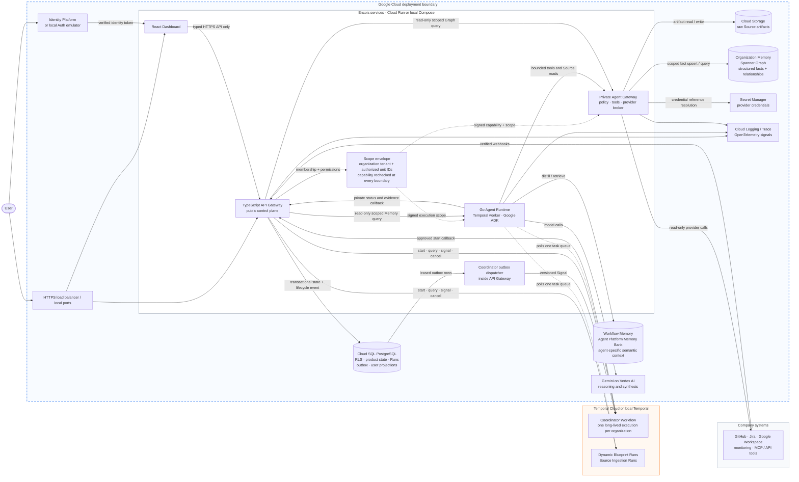

# Encois

Encois is an enterprise context-intelligence system. It connects scoped signals
from company systems, builds evidence-linked organizational context, and uses
bounded agents to explain what changed, why it matters, and what deserves
attention. Current version is read-oriented by default: observe, correlate,
explain, and recommend. Future versions would manage and do actions on behalf
of the user.

## Architecture

The dashed box is the hosted Google Cloud boundary. The local demo keeps the
same application topology with explicit mock adapters. Scope always starts
with the organization tenant and authorized organization-unit IDs; it is
calculated by API Gateway and rechecked by Runtime, Agent Gateway, and storage
adapters.



The stores have deliberately different responsibilities:

- PostgreSQL is the control plane: identity links, scope, configuration,
  outbox, Runs, and user-facing projections.
- Organization Memory is structured company context in Spanner Graph.
- Workflow Memory is agent-specific semantic context in Agent Platform Memory
  Bank.
- Temporal owns durable execution history, retries, waits, Signals, and
  recovery; it is not an application database.
- Cloud Storage owns large raw Source artifacts; agents access it through the
  private Agent Gateway.

## Run locally

Requires Node.js `24.19.0`, pnpm `11`, and Docker Desktop. No Google Cloud
credentials are needed for the default mock stack.

```bash
pnpm install
pnpm run local
```

The command builds and starts PostgreSQL, Temporal, Firebase emulators, the
populated Sun Inc seed, API Gateway, Agent Gateway, Agent Runtime, and the
Dashboard.

| Surface              | Address                 |
| -------------------- | ----------------------- |
| Dashboard            | `http://localhost:5173` |
| API Gateway          | `http://localhost:8787` |
| Temporal UI          | `http://localhost:8233` |
| Firebase Emulator UI | `http://localhost:4000` |

Sign in with `owner@local.test` / `local-password-1234`. Stop the stack with:

```bash
pnpm run local:down
```

Real Gemini, Spanner Graph, and Memory Bank are opt-in; see
[`docs/demo.md`](docs/demo.md). Local operation and troubleshooting are in
[`docs/operations.md`](docs/operations.md).

## Repository

```text
apps/dashboard       React SPA
apps/api-gateway     TypeScript/Hono public control plane
apps/agent-runtime   Go Temporal worker and Google ADK agents
apps/agent-gateway   private Go policy and tool broker
packages/contracts   versioned TypeScript/Go boundaries
packages/database    PostgreSQL schema and migrations
infra                Google Cloud deployment configuration
docs                 architecture, operations, security, and product guides
```

Key documentation:

- [`docs/architecture.md`](docs/architecture.md) — system boundaries and
  complete lifecycle.
- [`docs/contracts.md`](docs/contracts.md) — public, Temporal, Coordinator, and
  private service contracts.
- [`docs/demo.md`](docs/demo.md) — local/hosted demos, AI seed, and user invite.
- [`docs/operations.md`](docs/operations.md) — local operation, GCP, and CI/CD.
- [`docs/security.md`](docs/security.md) — trust boundaries and tenant
  isolation.
- [`docs/dictionary.md`](docs/dictionary.md) — canonical product vocabulary.
- [`docs/documentation.md`](docs/documentation.md) — user-facing product guide.
- [`docs/scripts.md`](docs/scripts.md) — supported commands and ownership.

The deployable services target Cloud Run, with Cloud SQL, Identity Platform,
Cloud Storage, Spanner Graph, Vertex AI, Memory Bank, Secret Manager,
Cloud Logging/Trace, and Temporal Cloud. Deployment is opt-in and documented
in [`infra/`](infra/) and [`docs/operations.md`](docs/operations.md).

## License

This private proprietary repository is available only for authorized
evaluation. It is not licensed for copying, forking, redistribution, reuse,
derivative works, or commercial use. See [`LICENSE`](LICENSE).
