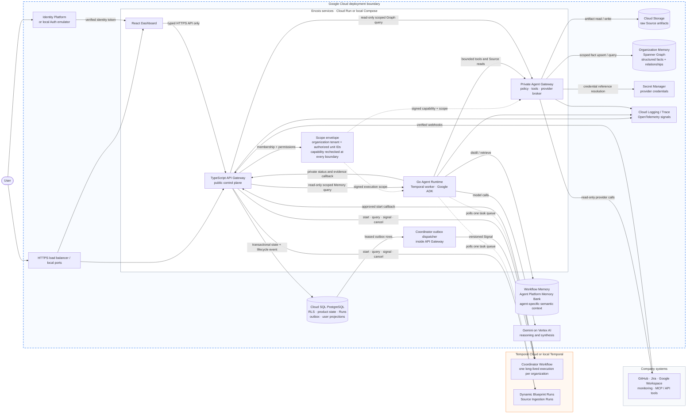

# Encois architecture

## Product

Encois is an organizational intelligence layer. It connects company systems,
documents, and operational signals, turns them into scoped context, and uses
bounded agents to explain what changed, why it matters, and what deserves
attention.

The product is read-oriented by default:

```text
observe -> correlate -> explain -> recommend
```

External write actions require a separate permission, approval, audit,
idempotency, and recovery boundary.

The main product concepts are:

- **Integration** — an organization-level connection to a provider.
- **Source** — a scoped provider resource or uploaded document.
- **Template** — a reviewed starting pattern for a workflow.
- **Blueprint** — the resolved, approved definition of workflow steps.
- **Workflow** — a named, scope-bound product process based on a Blueprint.
- **Run** — one Temporal execution of a Workflow.
- **Source Revision** — an immutable version of source content or metadata.
- **Blueprint Revision** — a future immutable version of a Blueprint. The
  current product stores Blueprint snapshots and a current registry pointer;
  explicit revision lifecycle is a later extension.

## System boundary

The dashed outer box is the hosted Google Cloud deployment boundary. Solid
arrows are current request, data, and execution paths; dotted arrows show the
scope envelope being rechecked across trust boundaries. The local mock profile
keeps the same application topology and replaces managed adapters explicitly.



The current outbox dispatcher is intentionally small and runs inside API
Gateway. A future Pub/Sub or Kafka relay may replace that delivery mechanism
without changing the event contract or Coordinator semantics.

### Gateway API

The TypeScript Gateway API is the public application boundary. It owns:

- authentication, organization membership, permissions, and effective scope;
- Integrations, Sources, Source Revisions, Templates, Blueprints, Workflows,
  Runs, audit records, and user-facing projections;
- validation of public API requests and private Runtime callbacks;
- the PostgreSQL schema and migrations;
- the transactional Coordinator event outbox and its dispatcher;
- the browser API. The browser never connects directly to Temporal, databases,
  provider APIs, Graph, Memory Bank, or Cloud Storage.

### Temporal Cloud

Temporal is the durable execution source of truth. It owns workflow history,
task delivery, retries, timers, Signals, cancellation, waiting, and
Continue-as-new. Temporal is not the company data store and does not replace
Gateway projections.

The long-lived per-organization Coordinator is also a Temporal Workflow. It
receives versioned lifecycle events and starts approved Blueprint executions
through a private Gateway route.

### Go Agent Runtime

The Runtime is a deployable Go worker. It polls the configured Temporal task
queue and runs
generic Blueprint workflows, source ingestion, Coordinator Activities, and
bounded specialist-agent work. It uses Google ADK and Gemini/Vertex AI where
configured. It does not connect directly to the Gateway database.

### Private Agent Gateway

The Agent Gateway is a separate internal Go service and policy/tool boundary.
It authenticates
Runtime calls, checks organization scope and capabilities, resolves provider
credentials without exposing them to agents, and exposes read-only provider,
Graph, Memory, and artifact operations. Provider-specific payloads stop at
this boundary and are mapped to typed internal evidence.

### Knowledge and memory

- Spanner Graph stores organization relationships and normalized connected
  facts when the GCP data plane is enabled.
- Agent Platform Memory Bank stores agent-specific semantic context.
- Cloud Storage stores large raw payloads and artifacts with retention rules.
- PostgreSQL stores control-plane records and user-facing projections.

These stores have different meanings. The Organization Memory Graph is the
structured, evidence-linked company context. Workflow Memory is a scoped,
derived semantic projection for agents. Cloud Storage keeps large raw
artifacts. None of them authorizes access, replaces Source provenance, or owns
Temporal execution state.

Each record remains organization-scoped and carries provenance where it can
affect an insight: source, provider record, observed time, ingestion time,
freshness, and transformation version.

## Scope and authorization

Organization is the hard tenant boundary. Within an organization,
`organization_units` form a hierarchy such as:

```text
Organization -> Department -> Team -> Project -> Person / System
```

The Gateway calculates effective scope from the authenticated membership and
selected organization unit. Scope is checked before loading records and again
at private data-plane boundaries. The Dashboard only renders scoped API
projections; it never expands access in the client.

The detailed security invariants are in [`security.md`](security.md).

## Canonical lifecycle

### Workspace readiness

1. A user authenticates through the configured identity provider.
2. The Gateway resolves organization membership and the selected scope.
3. The organization onboarding record is created or read.
4. The Gateway starts the long-lived Coordinator through Temporal.
5. The Coordinator reconciles registered Integrations, Sources, and catalog
   state, then reports `ready` or `failed` to the Gateway.
6. The UI unlocks product surfaces only from the persisted readiness state.

The Coordinator ID and Temporal IDs are server-owned. The browser may request
an operation but never supplies these identifiers as authority.

The persisted onboarding states are:

| State | Meaning | Product behavior |
| --- | --- | --- |
| missing row | control-plane migration or data defect | ordinary tenant routes return `503 ORGANIZATION_ONBOARDING_NOT_FOUND` |
| `pending` | setup can still be configured | onboarding routes remain available; ordinary product routes return `409 ORGANIZATION_ONBOARDING_REQUIRED` |
| `initializing` | Temporal accepted the Coordinator and initial reconciliation is running | show onboarding progress; wait for the private Runtime callback |
| `ready` | initial reconciliation completed and the Gateway persisted readiness | normal permission-scoped product routes are available |
| `failed` | start or bootstrap failed | show the stored error; an authorized administrator may reset and retry |

Before `ready`, the allowlisted API surface is limited to onboarding,
organization projection, onboarding Source upload/ingestion, and read-only
Template/Blueprint catalogs. A missing row is never treated as `pending`.

### Create a Workflow

The supported creation path is:

```text
choose Template or existing Blueprint
  -> choose organization scope and Workflow name
  -> enter configuration
  -> Preview Blueprint
  -> create Blueprint directly
  -> optionally queue a Workflow Run
```

Preview is read-only. The Gateway resolves Template provider slots against
active, authorized Integrations and validates scope, configuration, and
capabilities. Creation persists the resolved Blueprint snapshot directly.

### Start a Workflow

Blueprint creation and optional start are two explicit persistence boundaries.
The Blueprint snapshot is created first. If the user also selects start, the
Gateway performs one transaction for the execution request:

1. resolve the approved generic Workflow definition;
2. persist or reuse the queued Run projection with a stable Workflow ID;
3. persist a `workflow_start_requested` Run event;
4. enqueue `workflow-start-requested` in `coordinator_event_outbox`.

The dispatcher leases the outbox row and delivers the event to the correct
Coordinator through a Temporal Signal. The Coordinator validates the event,
calls the private Gateway start route, and the Gateway starts the generic
Blueprint Workflow in Temporal. Retries and duplicate delivery are safe
because the event, Run, and Temporal start use stable identities.

The browser therefore sees `preparing` while the queued database Run and its
outbox request exist but Temporal has not exposed the execution, then observes
the persisted projection synchronized from Temporal. A failed start is an
explicit error; it is not converted to a successful or fake Run state.

### Run execution

The generic Temporal Blueprint Workflow:

1. loads the approved Blueprint reference and immutable snapshot;
2. validates scope, business input, and execution context;
3. executes bounded steps and Activities through the Runtime;
4. records evidence references, step results, and terminal outcome;
5. waits on Temporal Signals or timers when a step is waiting, paused, or
   requires an explicit human decision;
6. updates Gateway projections for list/detail views.

The Dashboard reads both the Gateway projection and live Temporal state where
the API supports it. It never treats a missing projection as a successful
execution.

### Integration and Source ingestion

```text
authorize Integration
  -> store only the credential reference in the control plane
  -> activate provider capability after authorization/health succeeds
  -> enqueue integration-connected or provider-changed
  -> register a scoped Source and immutable Source Revision
  -> start encois.source-ingestion.v1
  -> Runtime reads through Agent Gateway
  -> persist ingestion projection and evidence/provenance
  -> optionally project Graph facts and Workflow Memory
  -> enqueue source-ready after successful reconciliation
```

Provider credentials stay in Secret Manager and are resolved by the private
boundary. Source configuration contains references and scope, not credentials.
Graph and Memory projections are derived from validated source evidence; a
provider failure remains visible as degraded, failed, or `needs_reauth`.

### Lifecycle events

The Coordinator event envelope is used for durable cross-component signals.
Current event types are:

- `integration-connected`;
- `provider-changed`;
- `source-ready`;
- `workflow-start-requested`;
- `workflow-completed`;
- `reconcile-requested` for workspace reconciliation.

Integration status changes and successful Source ingestion enqueue their events
in the same transaction as the database state transition. Workflow completion
is emitted when the Gateway projects the terminal Temporal result. The event
outbox is the durable handoff; direct Coordinator signalling is restricted to
the dispatcher adapter.

### Waiting, pause, and completion

`waiting` means Temporal is durable and waiting for a Signal, timer, external
condition, or explicit approval. `paused` is a product operation that changes
the execution through a versioned Temporal Signal. `completed`, `failed`,
`partial`, and `cancelled` are terminal outcomes. A page refresh or a list
query can reconcile projections, but it is not the source of truth for the
execution itself.

### Projection consistency

Workflow list/detail reads combine Temporal visibility with tenant-scoped
PostgreSQL projections. A queued database Run is visible as `preparing` before
Temporal start;
after start, Temporal owns the execution status and history while the Gateway
persists query-friendly events, evidence, retention, actor, scope, and audit
metadata. If either side is unavailable, the API reports unavailable or stale
state instead of manufacturing agreement.

## Data ownership

| Concern | Source of truth | Gateway role |
| --- | --- | --- |
| User and organization access | Gateway PostgreSQL + identity provider | authorize and project |
| Integration authorization | Gateway control plane + Secret Manager | store references and lifecycle |
| Source metadata and revisions | Gateway PostgreSQL | scope, freshness, ingestion state |
| Blueprint registry | Gateway PostgreSQL | immutable snapshot and current pointer |
| Temporal execution | Temporal Cloud | query and project status/results |
| Organization graph | Spanner Graph | scoped query proxy and projection |
| Agent memory | Memory Bank | scoped inspection and governed requests |
| Raw artifacts | Cloud Storage | typed reference and retention metadata |
| Cross-component delivery | PostgreSQL outbox, then Temporal | enqueue, lease, retry, audit |

## Deployment shape

The checked-in Terraform deployment uses or can enable:

- a global HTTPS load balancer for Dashboard and API routing;
- Cloud Run services for Dashboard, Gateway API, Agent Runtime, and Agent
  Gateway;
- a managed PostgreSQL control plane, preferably Cloud SQL;
- Identity Platform for Google authentication;
- Artifact Registry for immutable application images;
- Secret Manager for provider credentials;
- Cloud Storage for large artifacts;
- Spanner Graph for company context;
- Cloud Run jobs and Cloud Scheduler for migrations, retention, and Integration
  health dispatch;
- Cloud Logging, Cloud Trace, and OpenTelemetry-compatible exports;
- Temporal Cloud for durable execution;
- Vertex AI / Gemini and Google ADK for agent work.

Local development keeps the application and control plane in Docker Compose,
uses local Temporal and explicit adapter modes, and uses synthetic fixtures for
provider data. Local mock mode is an adapter configuration, not a second
product state model.

## Current implementation and future direction

| Area | Current reality | Future-compatible direction |
| --- | --- | --- |
| Workflow definition | immutable approved Blueprint snapshots | explicit Blueprint revision creation, promotion, deprecation, and diff lifecycle |
| Completion projection | terminal events are emitted when the Gateway observes/projects Temporal completion | proactive Runtime-to-Gateway completion callback or dedicated projection consumer |
| Event delivery | PostgreSQL outbox dispatcher inside Gateway | Pub/Sub or Kafka relay without changing the event envelope |
| Company context | tenant-keyed Spanner Graph projection | richer connected entity/relationship graph with the same provenance and scope rules |
| Workflow Memory | local adapter or Agent Platform Memory Bank adapter | provider-neutral `MemoryStore` or customer-owned memory API |
| Deployment | shared GCP services with organization isolation | dedicated customer GCP/Temporal profile where residency or isolation requires it |
| Assistant | Dashboard and operational product surfaces | scoped Pel AI briefings/questions over the same API, evidence, and permission boundaries |
| External actions | read-only tools by default | separately approved write tools with authorization, audit, idempotency, and recovery |

### Event transport evolution

The current Coordinator dispatcher lives inside the API Gateway because the
transactional outbox and the control-plane database are owned there. This is a
replaceable delivery adapter, not a permanent product boundary.

When delivery volume or operational isolation requires it, the dispatcher can
be replaced with:

```text
Gateway transaction
  -> coordinator_event_outbox
  -> outbox relay / CDC
  -> Google Pub/Sub or Kafka
  -> idempotent Coordinator consumer
  -> Temporal Signal / Update
```

Google Pub/Sub is the natural managed GCP option; Kafka is appropriate when a
shared event platform, replay, partitioning, or multi-consumer topology is a
requirement. The versioned event envelope, organization scope, event identity,
downstream idempotency, retry policy, and dead-letter handling must remain
unchanged. Pub/Sub or Kafka must not become the product source of truth, and
the migration must not introduce a second state machine beside Temporal and
PostgreSQL.

## Document map

- [`contracts.md`](contracts.md) — public, private, Blueprint, Temporal, and
  Coordinator event contracts.
- [`operations.md`](operations.md) — local stack, seed data, Temporal
  inspection, GCP deployment, and CI/CD.
- [`security.md`](security.md) — trust boundaries and security invariants.
- [`dictionary.md`](dictionary.md) — canonical vocabulary.
- [`documentation.md`](documentation.md) — user-facing product guide.
- [`scripts.md`](scripts.md) — supported repository scripts.
