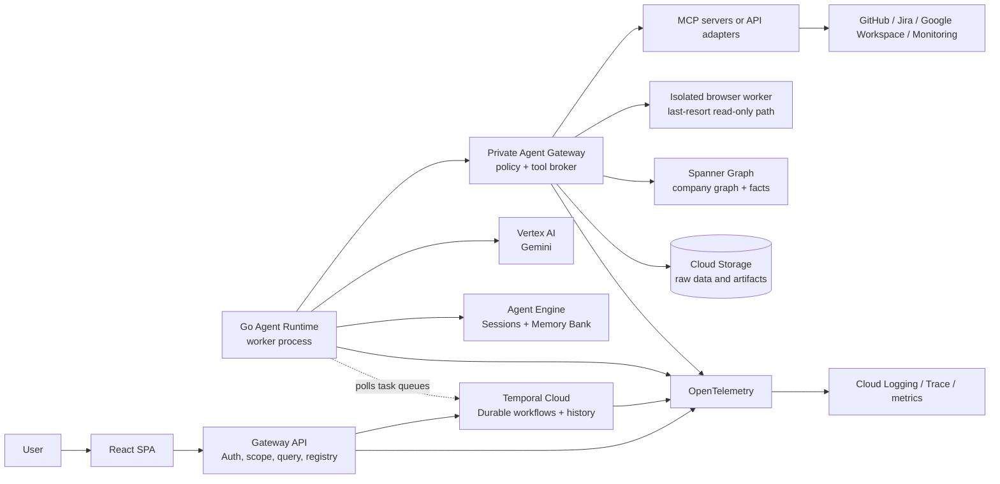
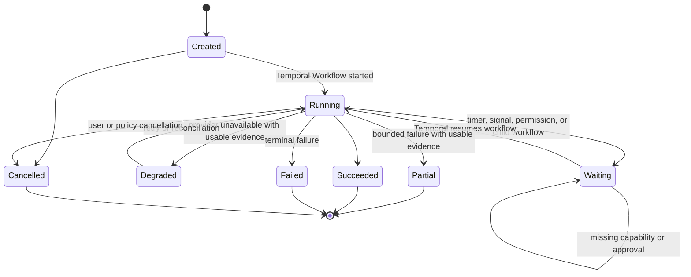

# Encois Architecture Specification

**Status:** proposed implementation baseline  
**Scope:** MVP and the evolution path immediately around it  
**Category target:** Fortified Enterprise Fleet

## 1. Purpose

Encois is an organizational intelligence layer. It reads signals from company systems, normalizes them, delegates bounded investigations to specialized agents, preserves evidence and history, and exposes scoped insights to people.

The system is read-oriented. It can recommend an action, but it must not change an external system without a separate approval, authorization, audit, and rollback path.

The architecture has four distinct responsibilities:

```text
Gateway API       -> users, auth, organization scope, registry, UI access
Temporal          -> durable workflow execution
Agent Runtime     -> Go workers, Google ADK agents, Activities, integrations
Memory/Graph      -> agent context and company relationships
```

The system does not build a custom durable-execution engine on Firestore. Temporal is the execution source of truth; company knowledge and agent memory live in purpose-built services.

The security properties for these boundaries, including tenant isolation, secret handling, agent policy, and execution-scoped capabilities, are defined in [`docs/security.md`](security.md).

The maintained visual map of the current system, including service boundaries, implementation status, and the release investigation path, is [`docs/system-diagram.md`](system-diagram.md). Keep it synchronized with the repository when a boundary or deployment path changes.

The architecture, system diagram, flows, protocols, security baseline, and
application READMEs are the maintained implementation references. Short,
cross-cutting product and engineering follow-ups live in
[`docs/next-steps.md`](next-steps.md); boundary-specific deferred work stays
next to the affected boundary.

## 2. Architectural position

The recommended initial deployment is a multi-tenant SaaS control plane with strict organization and scope isolation. The same contracts can later be deployed in a dedicated Google Cloud project for a customer that requires stronger isolation or data residency.

The selected platform shape is:

- React SPA for the authenticated product UI.
- Hono Gateway API for clients, authentication, authorization, organization scope, registry, and UI projections.
- Temporal Cloud for durable workflows, timers, retries, signals, cancellation, parallel branches, and workflow history.
- Go Agent Runtime using the Temporal Go SDK and Google ADK integration.
- Vertex AI / Gemini for model calls and evidence synthesis.
- Vertex AI Agent Engine Sessions and Memory Bank for session and agent-specific semantic memory.
- Spanner Graph for the shared company knowledge graph, organization relationships, and normalized connected facts.
- Cloud Storage for large raw payloads and investigation artifacts, with retention limits.
- Secret Manager for connector credentials.
- Cloud Logging, Cloud Trace, and OpenTelemetry-compatible instrumentation.

Temporal Cloud is the execution platform, not the company data store. Spanner Graph is the company context store, not the workflow engine. Memory Bank is agent context, not the canonical source of company relationships.

Temporal Namespace is an operational/deployment boundary, not the primary
tenant-security boundary. The MVP may use one shared Namespace with
organization-prefixed Workflow IDs, Gateway authorization, scoped Signals and
Updates, Agent Gateway policy, and tenant-scoped stores. A customer-isolated
profile may use a dedicated Namespace; strongest isolation uses a dedicated
Google Cloud project and Temporal environment/Namespace.

The first concrete GCP deployment baseline is documented in [`docs/infra.md`](infra.md). It uses Cloud Run for the Gateway API and the planned Go worker deployment, a global HTTPS Application Load Balancer with serverless NEGs for `/dashboard/*` and `/api/*`, Cloud Identity Platform for user authentication, Secret Manager for connector credentials, and optional Cloud Storage/Spanner resources. The Terraform stack is an explicit provider adapter; it does not create projects, manage Temporal Cloud, or run automatically from the repository.

## 3. System context



The Gateway API is the public north-south application boundary. Temporal Cloud is the durable execution and task-delivery boundary. The Go Agent Runtime is a deployable worker application that opens an outbound connection and polls Temporal task queues; Temporal Cloud does not execute Go code. The private Agent Gateway is the east-west policy and tool boundary. It is not exposed to the browser or public MCP clients. For the first vertical slice it may be an in-process Go module behind the same interface, but the target deployment is a separately deployable internal service.

Gateway-owned Coordinator lifecycle events are written to a tenant-scoped
transactional outbox in the same database transaction as plan approval or
application. A bounded one-shot dispatcher (`coordinator-dispatcher`) claims
events with a lease and retries delivery to the Coordinator Workflow through
Temporal. It is a process/job entrypoint, not a public route; production
deployment should invoke it per organization through a Cloud Run Job and
Scheduler. Webhooks are an incremental trigger only; the Coordinator also
uses Temporal timers or deployment-managed Schedules for reconciliation. The Go
Runtime never reads this outbox or the control-plane database.

Organization is the hard multi-tenant boundary. Inside it, `organization_units`
form a parent/child tree and may represent departments, teams, projects,
services, or future custom units. The Gateway computes effective scope
deterministically:

```text
effective scope = direct membership descendants
                + explicit grant descendants
                - explicit restriction descendants
```

The current persistence slice stores direct membership roots and the shared
contract/domain helper computes descendant inheritance. The Gateway owns the
organization projection, child-unit mutations, direct membership permission
mutations, role/scope checks, and audit events; the Dashboard consumes those
endpoints. Persisted explicit grant/restrict rules remain a separate extension
if direct-root inheritance becomes insufficient.

## 4. Core components

### 4.1 Web application

Use a React SPA. Astro is not part of the product architecture.

- React owns dashboard state, canvas interactions, chat/query state, and live run updates.
- Vite or an equivalent build tool produces a static client bundle.
- React Router or TanStack Router handles client-side routes.
- A typed API client and query/cache layer handle Gateway API data.
- Business rules, credentials, provider SDKs, and authorization decisions stay outside the browser.
- The UI receives only scoped projections and never queries Temporal, Spanner Graph, Memory Bank, or providers directly.
- **Organization context** is the Dashboard name for the scoped Graph projection. Organization units define the selectable scope; the browser never receives raw Graph or Memory Bank credentials.
- The Dashboard route tree fails closed without an authenticated browser session. The current local scaffold accepts a development-only bearer token through a session boundary; production token acquisition and refresh must be supplied by the Identity Platform/Firebase client adapter before hosted rollout.
- The full Compose path also provides a Firebase Auth Emulator and a verified
  local fixture account. This exercises the production-shaped bearer-token and
  invite provisioning path without GCP credentials; the development bearer
  fixture remains available only for explicit local API/UI diagnostics.

Primary screens:

1. Company Overview — health, active investigations, warnings, freshness, and scope.
2. Organization Context — scoped organization-unit structure, dependencies, graph relationships, evidence, and freshness.
3. Risks and Goals — releases, blockers, trends, owners, confidence, and evidence.
4. Agent Activity — investigations, workflow steps, tool calls, retries, signals, and traces.
5. Integrations — installed packs, health, granted scopes, last sync, and errors.
6. Organization and Permissions — company, departments, teams, projects, memberships, and grants.
7. Ask Encois — scoped natural-language questions and historical conversations.

Every intelligence view must show scope, observed time, freshness, confidence, evidence links, and limitations.

### 4.2 Gateway API and control plane

The Gateway API is a thin application boundary, initially implemented with Hono and TypeScript. It serves browser clients and trusted system callbacks.

It owns:

- authentication and organization membership;
- deterministic authorization and effective scope calculation;
- organization hierarchy and permission administration;
- the Agent Registry;
- Integration Pack registration and health;
- starting, signalling, querying, cancelling, and listing Temporal workflows;
- workflow identity and idempotency rules, such as one active execution per organization, Blueprint, and business key;
- user-facing requests for Graph, Memory Bank, and evidence projections;
- audit events and user-visible run projections;
- request IDs, rate limits, CORS, validation, and redaction.

The Gateway API does not execute long model or provider calls in an HTTP request. It starts or signals a Temporal Workflow and returns a workflow/investigation identifier.

The first Node.js blueprint exposes `POST /api/v1/workflows`,
`POST /api/v1/workflows/plans/validate`, and
`GET /api/v1/workflows/:workflowId`. The API derives a tenant-prefixed workflow
ID from the authenticated organization, workflow type, and request key, then
uses the Temporal TypeScript Client to start or describe the execution. The API
has no memory or database-backed product workflow adapter; local fixtures are
created by explicit scripts and are not execution truth. The Go runtime remains
the worker and owns the actual workflow implementation.

The API does not expose raw Temporal, Spanner Graph, or Memory Bank credentials to the browser. It maps those systems into stable, versioned contracts in [`packages/contracts`](../packages/contracts/), while provider-specific DTOs remain inside their adapters. The API is not the execution-time data-plane owner: Runtime Activities and Agent Gateway/data adapters perform scoped reads and writes, then return references or safe projections to the API. This distinction keeps the Gateway API out of provider/model work and keeps the Go Runtime out of control-plane Postgres.

Temporal commands that originate at the API have a second, database-backed
receipt boundary. Tenant-scoped Signal/Update receipts are claimed before the
Temporal call and finalized with the audit event. A crashed API may replay an
`in_flight` command, but a different payload under the same command ID is
rejected. This complements, rather than replaces, Temporal Update IDs and the
Go Workflow's Signal deduplication.

The dashboard's product boundary is intentionally higher-level than these
runtime commands. Workflow creation accepts a Template, approved Blueprint, or
manual intent and resolves Blueprint, revision, workflow, and run identifiers
inside the Gateway. Run control uses the versioned `workflow-signal.v1`
approval/pause/resume contract; cancel, retry, and rerun are separate audited
commands with persisted parent and revision lineage. Integration authorization
accepts only a service-side credential reference (for example a Secret Manager
reference), never a browser credential. Saved investigations and operational
notifications are organization/user-scoped control-plane records; external
email, push, and provider OAuth delivery remain deployment adapters.

The Gateway API is not a provider tool proxy and does not hold connector tokens for agent execution. Public API and future public MCP requests are translated into approved application capabilities such as `start_workflow` or `get_workflow_status`; they do not become arbitrary provider calls. If the control plane uses Postgres, the TypeScript API owns its schema and Drizzle migrations. Go workers do not connect to that database.

#### Workflow Template catalog

The Gateway owns a provider-neutral Workflow Template catalog for onboarding
and workflow discovery. `workflow_templates` stores searchable metadata such as
category, keywords, required capabilities, publication state, and the current
published version. `workflow_template_versions` stores immutable JSONB
snapshots. A template uses logical capability names and provider slots (for
example, `issue-tracker` can resolve to Jira or Linear); it contains no
credentials, integration IDs, provider payloads, or executable code.

`GET /api/v1/workflows/templates` returns the published version of up to ten
catalog entries after tenant context is established. Workflow Creator may use
the selected template as input for a typed, deterministic conversion into the
canonical `workflow-blueprint.v1` contract. The resulting tenant Blueprint is
then validated, approved, versioned, and persisted through the existing plan
boundary. Workflow Templates are a Gateway helper and are deliberately
unknown to the Go Agent Runtime, which continues to execute only validated
Blueprint snapshots.

#### Integrations, Sources, and unified ingestion

`Integration` is the organization-level provider connection. It owns the
provider authorization, Secret Manager reference, lifecycle status, and
granted capabilities for providers such as Jira or GitHub. Integrations are
not duplicated for every team, and credentials never move into browser state
or Source configuration. Creating or changing an Integration is restricted to
organization administrators.

`Source` is the organization-unit-level provider resource or uploaded/manual
origin that supplies evidence. An integration Source references an existing
Integration and stores the provider resource selection (for example Jira
project, GitHub repository, or Slack channel) together with read and
visibility scopes. The organization root can also own a Source when the
resource is intentionally available across the organization. MVP kinds are
`integration`, `uploaded_document`, `manual`, and `media`.

An Integration binding is kept at the organization root as a capability grant,
not as a per-unit credential. The caller's membership and manager permissions
still gate every Source read or mutation. A Source or Workflow may use the
connection only when an active Integration grants the required capability and
the Source's read/visibility scopes cover the effective execution scope. The
Dashboard may request a selected unit for filtering, but the Gateway
recomputes and validates that scope server-side.

Uploaded or provider data is represented by an immutable `Source Revision`.
Postgres stores source/revision metadata and an `artifactRef`; raw bytes stay
in the artifact store boundary (target: Cloud Storage), not in Postgres,
Temporal history, or model context. Every normalized fact must retain
`sourceId`, `sourceRevisionId`, an optional `sourceRecordId`, an artifact
reference, and a precise locator such as page, object ID, or timestamp.

All source kinds converge after acquisition on the same platform-owned
`encois.source-ingestion.v1` Workflow:

```text
Source / Revision
  -> acquire or fetch through Agent Gateway/data adapter
  -> parse, OCR, or transcribe
  -> validate scope and redact model-facing data
  -> extract entities, facts, relationships, and evidence
  -> normalize and project to Spanner Graph
  -> optionally distill scoped agent context to Memory Bank
```

The Workflow is registered Go code and is not a user-created Blueprint. Integration
bootstrap, webhook, schedule, reconciliation, and an uploaded-document ingest
all start this same Workflow with a different trigger and revision. User
Blueprints remain provider-neutral execution graphs that consume source
evidence; Workflow Templates remain a separate discovery/catalog layer and do
not reference source IDs or become executable definitions.

The implementation exposes source registration, PDF upload, immutable revision
metadata, source detail/status projection, raw-file download, and an ingestion
launch route in the Gateway API. PDF bytes are written through the Gateway's
scoped Cloud Storage adapter (Firebase Storage Emulator in Watch mock, managed
Cloud Storage in hosted environments, and an explicit development/test memory
fallback), under an organization/unit/source/revision object prefix. Only the
resulting artifact reference crosses the revision and Temporal boundaries. The
Runtime validates the versioned envelope, reads through Agent Gateway, and
returns a completed result after deterministic facts, provenance, Graph, and
Memory stages. OCR/transcription and live provider acquisition remain
provider-specific adapters.

#### Initial Google Cloud control-plane implementation

The initial control plane uses Cloud Run for the Hono Gateway API, Google Cloud Identity Platform for human identity, Cloud SQL for PostgreSQL control-plane state, Drizzle ORM/migrations for schema ownership, Cloud Storage for large artifacts, Secret Manager for credentials, and Temporal Cloud for durable workflow execution. The browser talks only to the Gateway API; it does not access Cloud SQL, Cloud Storage, Temporal, or provider APIs directly.

Identity Platform verifies the caller and provides an external subject. The Gateway maps that subject to an Encois `users` row, organization membership, role, and hierarchy scope in Cloud SQL. Identity tokens do not grant organization access by themselves. The database uses a separate privileged migration connection and a restricted `api_gateway` runtime capability role. Tenant tables use PostgreSQL row-level security as defense in depth, while deterministic authorization remains in the Gateway.

RLS is intentionally limited to the database tenant boundary. The Gateway also
performs object-level checks before reading or mutating an integration or
workflow: active membership, organization-unit scope, role permission, and (for
workflow reads) ownership or read permission. This keeps dynamic permission
logic in typed application code while preserving RLS as a second barrier if a
query is accidentally under-scoped.

The initial schema and operational details are documented in [`GCP.md`](GCP.md). Redis is intentionally deferred because it is not required as a source of truth for the first vertical slice.

### 4.3 Temporal Cloud and durable execution

Temporal Cloud is the execution source of truth for investigations and long-lived agent processes. It stores workflow history and schedules work, but it does not run the application's workflow or Activity code.

Temporal provides:

- durable workflow state and history;
- timers and waits lasting days or weeks;
- retries and timeout policies for Activities;
- Signals for external events, permissions, and human approvals;
- parallel branches and child workflows;
- cancellation and cooperative termination;
- workflow visibility and execution IDs;
- recovery after worker restarts or deployment changes.

The Gateway API and the Go Runtime each use a Temporal client for different purposes. The Gateway API uses its client to start, signal, query, describe, and cancel workflows; the dashboard exposes cancellation through a permission-checked, auditable cancel route, while re-run creates a new server-owned run with persisted parent lineage. The Go Runtime uses its client to connect a Worker to a task queue and may use it for child workflows or Signals. A Worker polls the configured Temporal endpoint, local or hosted; Temporal never reaches into the runtime to execute code.

The business workflow is defined in code, but Workflow code must remain deterministic. Gemini calls, database calls, graph writes, Memory Bank calls, and MCP/API calls run as Temporal Activities. Activities are functions registered in a Worker, not independently deployed microservices.

Workflow inputs, Signals, and results are small, versioned contract objects. They contain identifiers, scope, policy version, and references to external data, not raw tickets, provider payloads, secrets, or large model responses. Large or sensitive data is persisted in its owning store and passed between steps by a validated reference.

The UI reads a safe projection of Temporal execution through the Gateway API. Temporal history is not the same thing as company memory; it explains how a result was produced.

### 4.4 Go Agent Runtime

The Go Agent Runtime is one deployable Go application in the MVP. It creates a
Temporal client, registers a Worker on the configured task queue, and hosts
Google ADK agents, specialist definitions, Activities, and integration clients.
It is isolated from the TypeScript Gateway API by versioned contracts and
Temporal task queues. It reaches external systems through the private Agent
Gateway. The runtime does not need the Gateway API's control-plane database; it
receives stateless execution context and data references through Workflow/
Activity inputs.

The runtime has two possible ADK execution profiles. The current profile is the
simple Activity boundary; the native profile is a migration candidate and is
not enabled in this repository.

Current Activity-boundary profile:

- the registered generic Blueprint Workflow interprets validated step kinds;
- ADK runs approved agent steps and provides reasoning, delegation, and structured output;
- Gemini/model calls, I/O tools, MCP/API calls, and data-store operations cross a Temporal Activity boundary;
- ADK sub-agents provide logical specialist delegation inside an execution;
- human approval can pause the Workflow and resume it through a Signal or Update;
- long conversations can use `continue-as-new` to keep history bounded.

Native Temporal/ADK candidate:

- `go.temporal.io/sdk/contrib/googleadk@v0.2.0` runs the ADK loop in Workflow code;
- `googleadk.NewModel` dispatches each model turn to a worker-side `InvokeModel` Activity;
- deterministic ADK function tools can run in Workflow code, while network/I/O tools use `ActivityAsTool` or the MCP proxy;
- the module currently requires Temporal Go SDK `v1.45.0` and an ADK revision containing the required determinism seams;
- this package was tested independently, but is not yet a repository dependency. The current Activity profile remains the fallback until the one-agent spike proves retry, history, approval, and MCP behavior.

The target runtime composition is:

```text
Temporal Workflows
  -> coordinator agents
  -> specialist agents
  -> Activity implementations
  -> private Agent Gateway client
```

The current repository implements the Workflow/Activity layer, ADK bundle,
private Agent Gateway client, local mock data plane, and GCP adapters. The
Agent Gateway owns Cloud Storage and Spanner access; Runtime Activities own
scoped Vertex AI Memory Bank calls. The Runtime continues to receive
references and stateless context, not connect to the Gateway API's control-plane
Postgres. Hosted adapter validation, retention, deletion, and provider quality
remain deployment concerns.

The first vertical slice can implement the Agent Gateway interface in the same Go process to reduce deployment work. The interface and security contract must still be explicit so extraction into a private Cloud Run service does not change agent or workflow code.

Current code status: the worker registers `encois.dynamic.v1`, the
Coordinator, bootstrap, and platform-owned `encois.source-ingestion.v1`
workflows; it does not register provider-specific or user-specific Temporal
Workflow types. The generic interpreter, source-revision envelope, scope propagation,
authenticated Runtime-to-Gateway calls, read-only policy, worker health
listener, and API → Temporal → Go → Agent Gateway synthetic smoke path are
tested locally. The TypeScript API and the Go Runtime/Agent Gateway now consume
the same embedded canonical JSON Schemas at their active boundaries. The
Coordinator now calls a proposal Activity and a private control-plane submit
Activity after reconciliation triggers. Gateway plan approval/application
enqueue tenant-scoped `coordinator-event.v1` envelopes transactionally in the
control-plane outbox. The API includes a bounded lease/retry dispatcher,
Temporal sink, and a one-shot dispatcher entrypoint, but Cloud Run
Job/Scheduler wiring remain pending. An applied plan emits `workflowStarts`
only for explicit change-level `start` intents; the Coordinator starts those
immutable approved snapshots through a typed private Gateway Activity and keeps
failed starts in Workflow state for retry.
Generated DTO generation, hosted Temporal/Cloud Run deployment, and real
provider adapters also remain pending. These Runtime Activities do not access
Postgres and cannot approve or bypass the registry.

In Google Cloud, the Runtime uses Vertex AI through the GenAI/ADK client with
Application Default Credentials and its dedicated service account. The
Runtime-to-Gateway control-plane adapter can send both a Cloud Run ID token and
the scoped Encois service token; Terraform grants the Runtime service account
the API invoker role and supplies the API URL/audience. Local development may
continue using a Gemini API key and a local service token.

The runtime is not a permanent “head agent,” and a specialist is not a server per repository. The registered `encois.dynamic.v1` Workflow interprets one validated company-specific Blueprint. It can execute agent or tool steps for Jira, GitHub, monitoring, or any other enabled pack. One Worker process can execute many such workflow instances concurrently, subject to task-queue and connector limits.

For the current vertical slice, ADK runs inside a Temporal Activity. This is a
deliberate simple boundary: the Workflow remains deterministic and Temporal
durably retries the Activity as one unit, while the internal ADK/model/tool
turns are not separately represented in Temporal history. The native option is
a finer-grained execution profile, not a replacement for the generic Blueprint
contract. Do not make arbitrary network calls from deterministic Workflow code.
ADK provides agent reasoning, delegation, and structured output; Temporal
provides durable state, waiting, retries, Signals, and recovery.

The model cannot invent a tool, widen scope, select a different organization, or bypass the Agent Gateway.

Model policy is role-specific. High-volume specialists, routine synthesis, and
generic Blueprint Agent Definitions use the standard `GEMINI_MODEL` profile,
defaulting to the stable `gemini-3.7-flash`. The Coordinator and Workflow
Creator use a separate high-responsibility reasoning profile
(`GEMINI_REASONING_MODEL`, default `gemini-3.1-pro-preview`) with
`GEMINI_REASONING_THINKING_LEVEL=high`, because they make cross-source plans
and propose changes to the workflow catalog. Other configuration names are
intentionally not supported; before the first release,
configuration changes may be breaking and must be updated everywhere together.
Thinking output is not exposed as chain-of-thought in logs or the UI; only
validated decisions, evidence references, and structured results leave the
agent boundary.

### 4.5 Organization onboarding and Coordinator

Onboarding is a required product state, not an optional setup wizard. A new
organization is not ready for the intelligence dashboard until it
has enough connected sources or uploaded documents to build an initial context.
Before that point the UI shows onboarding progress, missing integrations, and
data requirements rather than empty or misleading intelligence panels.

Each organization scope has one logical long-lived Coordinator. The
Coordinator is represented by a Temporal Workflow instance and an approved
Coordinator Agent definition; it is not a permanently running process or a
special container. Its responsibilities are:

  - coordinate onboarding and initial organization bootstrap;
- collect source availability, integration health, and document readiness;
- request deterministic ingestion and memory-building Activities;
- ask Gemini/ADK to propose bounded workflow changes from an approved blueprint catalog;
- start, update, pause, deprecate, or reconcile workflow executions through control-plane contracts;
- monitor workflow outcomes and periodically reconcile stale or obsolete workflows.

The Coordinator has broad read/discovery access to the authorized organization
context so it can detect missing capabilities and propose useful
workflows. This does not mean unrestricted authority: it still goes through
the Agent Gateway, cannot read connector secrets, cannot widen tenant scope,
and cannot perform external writes without the normal authorization and
approval boundary. “Full memory” means the complete authorized organization
context, not a bypass of permissions.

The control-plane onboarding lifecycle is:

```text
pending
  -> initializing
  -> ready
initializing
  -> failed
  -> initializing   (explicit administrator retry)
```

`pending`, `initializing`, `ready`, and `failed` are the persisted
`organization_onboarding.status` values. A missing onboarding row is not a
recoverable business state: it is a control-plane data or migration defect.
The API returns `ORGANIZATION_ONBOARDING_NOT_FOUND` with HTTP `503` and does
not create a row as a side effect of a read. Migration/backfill or an explicit
repair operation must resolve it.

The runtime has a separate internal phase vocabulary (`ONBOARDING`,
`BOOTSTRAPPING`, `READY`, and `RECONCILING`) for the long-lived Coordinator
Workflow. The runtime reports only the externally meaningful readiness result
back to the Gateway. `POST /organization/onboarding/start` persists
`initializing` after Temporal accepts the idempotent start request; it never
marks the organization `ready` merely because a Workflow was started. The
Coordinator performs its first reconciliation immediately, then reports
`ready` only after required context validation succeeds or `failed` when
bootstrap is deferred or errors. Retry is explicit, reuses the stable
Coordinator identity, and does not fabricate progress or product records.

Until `ready`, a tenant is allowed to read/update onboarding settings, use the
onboarding Source upload/ingestion path, browse the active Template and
approved Blueprint catalogs, and start or retry onboarding when authorized.
Ordinary dashboard, member/unit, integration, Workflow, Run, review, and
other product routes are rejected with `ORGANIZATION_ONBOARDING_REQUIRED`
and HTTP `409`. The route gate is applied before product authorization and
does not replace the existing permissions model; permissions still determine
what a ready organization may do. A user without `onboarding:manage` can see
progress and the administrator handoff but cannot change onboarding or retry.

This tenant gate is independent from `GET /health/ready`, which is a
service/dependency readiness check. The API must not report itself unhealthy
because an individual organization is pending or failed. The complete state
matrix and route exceptions are maintained in
[`flows.md`](flows.md#onboarding-readiness-states).

The Coordinator waits in Temporal between signals, schedules, and external
events. Typical signals are integration connected, document uploaded, refresh
requested, workflow completed, provider changed, and approval resolved. A
short `BootstrapProjectWorkflow` performs the initial phase; the long-lived
`CoordinatorWorkflow` remains the logical owner afterwards.

Temporal does not create new Go code from a prompt. A Workflow Creator may
produce a typed `WorkflowChangePlan`, but a deterministic validator and the
Gateway API must approve it against the tool/agent catalog, organization
scope, policy, and versioned Blueprint schemas. Temporal starts the
pre-registered generic `encois.dynamic.v1` Workflow and can
create/update/pause schedules through its Schedule API. A stored Blueprint is
configuration interpreted by that generic Workflow; it is not executable code.

For the manual workflow builder, the compatible implementation is the
pre-registered `encois.dynamic.v1` generic Workflow. The Blueprint is a
validated DAG of typed steps such as tool, agent, transform, condition, wait,
and approval. Steps with the same satisfied dependencies run in parallel,
while dependencies create ordering. The Agent Gateway can validate the tool
catalog and derive required permissions, but the API Gateway remains the
authoritative owner of persisted definitions, user grants, idempotency, and
Temporal start/signal/schedule operations.

The Coordinator is logically endless but must not accumulate one unbounded
history. It uses Temporal Continue-As-New when history or reconciliation
iterations reach a safe threshold, carrying compact Coordinator state into a
new Run ID under the same Workflow ID. The logical Coordinator therefore never
stops during normal operation while each concrete execution remains bounded.

The memory layers remain separate:

```text
Temporal          = Coordinator state, waits, signals, execution history
Spanner Graph     = canonical organization facts and relationships
Cloud Storage     = raw source snapshots and large documents
Memory Bank       = scoped semantic context and bootstrap distillations
Gateway API DB    = onboarding state, registry, blueprint versions, projections
```

Memory generation is an explicit Activity or service call. ADK/Memory Bank
does not implicitly extract durable memories merely because an agent ran.

### 4.6 Agent Registry

The registry contains approved, versioned definitions. A definition includes:

- stable ID and version;
- role and purpose;
- accepted input and output schemas;
- allowed tools and required scopes;
- model configuration and budget;
- timeout, retry, and concurrency limits;
- owning Integration Pack or domain;
- lifecycle status: draft, approved, disabled, retired.

The registry is configuration, not a list of running processes.

An Agent Run is one execution of an approved definition. It is represented by workflow/run identifiers and projections; it does not require a new container. The Registry can report a missing capability without treating it as an infrastructure crash. The workflow may enter `WAITING_FOR_CAPABILITY` and ask an administrator to enable the required Integration Pack.

### 4.7 Integration Packs

An Integration Pack is the canonical name for what the product UI may call a “Jira agent manager” or “GitHub manager.” It packages:

- connector configuration and health checks;
- API adapters and/or MCP servers;
- normalized fact mappers;
- read-only tool definitions;
- source-specific evidence types;
- one or more approved specialist Agent Definitions.

Packs may be implemented in Go, TypeScript, or another language. They must expose the same versioned tool and evidence contracts to the Agent Gateway.

For example, a Jira Pack can expose `search_issues`, `read_issue`, and `read_sprint`. A Jira specialist run may use those tools, but it is not a permanently running Jira manager.

The same rule applies to repositories. A GitHub Pack provides one GitHub connector and a GitHub specialist definition. A workflow fans out Activities over the authorized repositories; it does not deploy one GitHub agent server per repository.

### 4.8 Private Agent Gateway, policy, and MCP

The Agent Gateway is a private policy-enforcing tool broker. It is a separate internal Go service in the target architecture, reachable only from the Agent Runtime over authenticated service-to-service communication. A first-slice in-process implementation is acceptable, but browsers, public MCP clients, and models must never call provider systems directly.

The initial implementation is a Gin-based internal HTTP service in
`apps/agent-gateway`. Its MVP boundary is intentionally small: authorization
checks, a fixture-level MCP-shaped tool catalog and invocation boundary, a
scope-aware Graph query/upsert boundary, and a Cloud Storage artifact
read/write boundary backed by selectable mock/GCP adapters. Agent-specific Memory Bank access is a
separate typed Runtime Activity boundary, not a public Gateway data source.
Source registration remains in the Gateway API control plane; the
Agent Gateway only brokers source acquisition, artifact access, provider
tools, and scoped Graph projection under the Runtime execution context.
Catalog
entries include a version, input/output schemas, behavior annotations,
availability, approval metadata, and required scope fields; invocation checks
the registered capability and required scope after policy authorization. The
local mode keeps deterministic Jira and GitHub fixtures, while hosted GCP mode
uses typed, read-only GitHub and Jira adapters. Those adapters resolve a
provider capability through the private control-plane boundary, read the
organization-scoped Secret Manager reference, validate the provider response,
and return bounded evidence/freshness projections. Connector grants and
provider token rotation/health scheduling remain deployment policy; arbitrary
tool execution and unsafe artifact paths are denied by the current boundary.
The Cloud Storage and Spanner adapters are selected by the Gateway data mode.

In a hosted deployment, Cloud Run IAM authenticates the Runtime with a Google
ID token targeted at the Gateway service URL. The Runtime sends the Encois
service token separately in `X-Encois-Service-Token`; the Gateway checks both
the platform identity and its application-level token before evaluating tool
policy. Local smoke tests use the same application token as a bearer token
because there is no Cloud Run IAM boundary.

The invocation path is:

```text
ADK agent
  -> validate registered tool and input
  -> resolve actor, organization, scope, and agent policy
  -> acquire scoped connector credential
  -> call MCP server or typed API adapter
  -> validate, normalize, redact, and record result
  -> return minimum required data to the agent
```

- Read tools are the default and are separate from write tools.
- The model never receives long-lived provider credentials.
- The model cannot choose the organization, user identity, or host through tool arguments.
- Outbound hosts, methods, payload sizes, timeouts, and concurrency are allowlisted.
- Provider text is treated as untrusted data, not as instructions or policy.
- Browser automation is a last-resort connector behind a sandbox, domain allowlist, short-lived credentials, and read-only policy for the MVP.
- A future write tool must require explicit human approval and produce an audit record before execution.

The execution context passed through Temporal contains the actor, organization, effective scope, integration grant, request ID, and policy version. The Agent Gateway validates that context and re-checks current policy for sensitive operations or when the policy version is stale. A model-supplied organization, user, host, credential, or permission is never trusted. Connector credentials are resolved by the Agent Gateway from Secret Manager and are never placed in Temporal history or model context.

The current private credential-resolution request is provider/capability based;
the Runtime already carries the Workflow execution scope into Agent Gateway,
but the normal provider resolver does not yet receive that scope as a selection
input. Before multiple overlapping provider bindings are enabled in production,
the private resolver should accept the execution scope and require a binding to
cover it, with an explicit integration ID when a Workflow has one. No Agent
Gateway or Runtime code is required for the current control-plane/UI change.

The communication boundary is intentionally asymmetric:

```text
Gateway API -> Temporal Cloud       start/signal/query/cancel workflows
Go Runtime  -> Temporal Cloud       poll task queues and report execution
Go Runtime  -> Agent Gateway        private tool request with execution context
Agent Gateway -> provider/MCP       scoped API or MCP call
Agent Gateway -> Cloud Storage      raw response/artifact, when required
Agent Gateway -> Spanner Graph      normalized facts and relationships, when a tool ingestion requires it
Runtime Activities -> Memory Bank   agent-specific retrieval/distillation, when enabled
Runtime/API adapters -> Graph       scoped query/projection, when enabled
```

The Agent Gateway does not own workflow state, replace Temporal, or become a second public API. It enforces policy at the last point before an external call and returns a minimal normalized result plus evidence/data references.

MCP is the standard tool discovery/invocation boundary, not the system's
workflow or data source of truth. The Gateway API and deterministic policy
layer own identity, authorization, and organization scope. The internal Agent
Gateway may expose MCP-shaped JSON over authenticated HTTP first and add a
full MCP JSON-RPC adapter later if external clients need it.

The first UI may call the Gateway API directly to start a Blueprint execution.
MCP can later expose the same application capabilities to a conversational
client, for example `start_workflow` or `get_workflow_status`; it is not
required to be the UI's primary transport.

### 4.9 Shared contracts and ownership

Use different contract formats for different boundaries instead of trying to share implementation code between TypeScript and Go:

| Boundary | Canonical format | Consumers | Purpose |
|---|---|---|---|
| Browser/public Gateway API | OpenAPI | TypeScript API, React client, future MCP adapter | HTTP routes, auth errors, pagination, request/response DTOs |
| Temporal Workflow inputs, Signals, results | JSON Schema | TypeScript Gateway API and Go Runtime | Small cross-language durable-execution payloads |
| Workflow Blueprints | JSON Schema with MCP-shaped tool references | Coordinator, Creator, Gateway API, Go Runtime, UI builder | Company-specific executable configuration for the generic Workflow |
| Blueprint registry snapshots | Tenant-scoped Postgres rows with JSON Blueprint payloads and an explicit current pointer | Gateway API, UI, future Coordinator application flow | Approved configuration materialized from `workflow-change-plan.v1` create/update/deprecate/restore/set_current; current state is organization-scoped and never queried directly by Go Runtime |
| Agent Gateway requests/results | JSON Schema over authenticated internal HTTP/JSON for MVP | Go Runtime and private Agent Gateway | Tool invocation, execution context, policy decision, data references |
| API Temporal command receipts | Gateway-owned Postgres schema | TypeScript Gateway API | Tenant-scoped Signal/Update idempotency and replay state; never sent to Go or Temporal |
| Integration manifests and evidence events | JSON Schema | pack registry, adapters, graph/memory pipeline | Versioned plugin and normalized-data contracts |
| Database schema | SQL migration source owned by its service | TypeScript control plane or data service | Persistence implementation; never a shared DTO |

The source of truth is the schema, not generated code. TypeScript types and
Ajv validation live in `packages/contracts`; the Go side embeds the same schema
files and keeps service-local DTOs plus semantic validators. Generate Go types
only if they reduce maintenance, and keep generated artifacts local to each
language package. Do not import TypeScript source into Go, expose database
client types in contracts, or pass provider SDK payloads across the boundary.
Protobuf and gRPC can be added later if service count or throughput justifies
them; they are not required for the MVP.

The detailed layout, naming, validation, compatibility rules, and examples live in [`docs/contracts.md`](contracts.md).
The standard-selection and generic communication model live in [`docs/protocols.md`](protocols.md).

### 4.10 Memory, graph, and data model

Encois uses purpose-specific memory layers instead of one universal database.

#### Temporal execution memory

Temporal stores the workflow history required to resume an investigation: current workflow state, Activity results, timers, Signals, retries, and child workflow relationships. It is operational history, not a company knowledge base.

#### Agent Engine Sessions and Memory Bank

Agent Engine Sessions hold conversation/session context. Memory Bank holds agent-specific semantic memories such as recurring preferences, prior conclusions, working context, and important outcomes.

Memories are scoped explicitly, for example:

```text
organization_id = acme
agent_id = context-synthesizer
user_id = user-123       # optional
team_id = platform       # optional
```

Memory retrieval must use the exact authorized scope. Agent-specific memory must not become invisible cross-team knowledge.

The current Vertex Memory Bank adapter maps organization, agent definition, and
optional project/user scope, but does not yet materialize the full Encois
organization-unit hierarchy in the provider scope. The API still performs the
human authorization check and carries the effective unit scope in the request;
provider-level unit isolation is a follow-up design decision, not an assumed
MVP capability. See [`memory.md`](memory.md) for the current behavior and
provider-neutral options.

Memory Bank is a managed semantic memory service. It is not the canonical source of truth for company entities, relationships, permissions, or evidence.

#### Spanner Graph

Spanner Graph is the canonical shared company context layer. It stores organization structure, entities, relationships, normalized facts, and temporal/provenance metadata.

Example graph model:

```text
Person       - MEMBER_OF      -> Team
Team         - PART_OF        -> Department
Team         - OWNS           -> Project
Ticket       - BLOCKS         -> Release
Commit       - IMPLEMENTS     -> Ticket
Deployment   - AFFECTS        -> Service
Incident     - RELATED_TO     -> Release
Person       - RESPONSIBLE_FOR-> Ticket
```

Every graph node and edge should preserve:

```text
organization scope
source system
source record ID
observed_at
valid_at / invalid_at
ingested_at
transformation version
confidence
visibility scope
```

Agents may propose a relationship, but deterministic ingestion and validation code decides whether it becomes a canonical graph fact.

#### Raw artifacts and retrieval

Cloud Storage holds large raw provider payloads, exports, and artifacts under organization-scoped paths. Vertex AI RAG Engine or another approved retrieval layer may index documents when semantic document search is needed. Raw payloads are not copied wholesale into prompts, Temporal history, Memory Bank, or graph properties.

The normal data path is:

```text
provider API / MCP
  -> Agent Gateway validates and captures the response
  -> Cloud Storage keeps the raw, organization-scoped snapshot
  -> adapter validates and normalizes source facts
  -> Spanner Graph stores durable entities, relationships, provenance, and freshness
  -> Memory Bank stores a small agent-specific distillation when useful
  -> Temporal keeps only execution state and references
  -> Gateway API returns a scoped projection to React
```

Memory writes have an explicit boundary and never receive an unrestricted raw
provider payload:

```text
raw evidence -> validation -> deterministic PII/secret filtering
  -> fact extraction -> concise distillation -> scoped Memory Bank
```

The MVP filter is a small standard-library regex adapter for obvious email,
phone, token, and API-key patterns (`regex-v1`). It is useful defense in depth,
not a complete PII detector. Provider-specific classifiers, configurable data
classification, and an optional model-assisted review remain TODOs. Graph
facts retain business provenance and freshness; Memory retains reusable
patterns and conclusions, not canonical relationships or authorization data.

Cloud Storage keeps only referenced raw/large artifacts for a stated retention
class (`ephemeral`, `investigation`, `source_snapshot`, or `legal_hold`). SQL,
Temporal, Graph, and Memory carry references or distilled fields rather than
unbounded payload copies. Retention/TTL enforcement is a hosted adapter and
policy TODO; the local artifact adapter records the class now.

The raw snapshot is evidence and replay material; the graph is the shared structured context; Memory Bank is selective agent context; Temporal is operational execution history. A model may summarize or propose facts, but deterministic adapters and policy checks decide what is persisted as canonical data.

Initial logical entities:

```text
Organization
OrgUnit(organization | department | team | project | service | custom)
Membership
ScopeGrant
Integration
IntegrationPackVersion
AgentDefinitionVersion
Investigation
WorkflowReference
SourceFact
GraphNode
GraphEdge
Evidence
Insight
ConversationSession
AgentMemoryReference
AuditEvent
```

### 4.11 Identity and authorization

#### Invite-only human access (MVP)

The first product access mode is invite-only Google authentication. Encois does
not expose email/password authentication, public sign-up, or self-service
organization creation. Google/Identity Platform proves the external identity;
the Gateway decides whether that identity has Encois access.

An operator creates the first organization, root organizational unit, system
roles, and an `organization_invites` row using the API package's operator
scripts. The invite is keyed by a normalized email address and carries the
organization, role, and initial scope. On the first successful Google sign-in,
the Gateway verifies the ID token, requires a verified email and the allowed
`google.com` sign-in provider, accepts the pending invite in one transaction,
creates the local `users` row and active membership, and sends the user to
onboarding.

An authenticated Google identity without a pending invite receives a
`pending` status, is not given a principal, and cannot access any
tenant-scoped route. The Dashboard signs the user out and presents the public
waitlist page. The waitlist is a product-access request, not a membership or
authorization source.

The MVP intentionally accepts that an unknown Google first sign-in may create
an Identity Platform user record while creating no Encois access. A future
Identity Platform `beforeCreate` blocking function may enforce the allowlist
before the external record is created; that deployment boundary is deferred
until the access store and blocking-function latency budget are operational.

There is no separate management UI in this phase. `apps/api-gateway/scripts`
owns operator-only bootstrap, invite, revoke, and waitlist-listing commands.
`packages/persistence` owns only the schema and migrations; it does not import
Identity Platform SDKs.

The email is only the invite/admission key. The durable local identity is the
pair `(identityProvider, identitySubject)`, where the subject is the Identity
Platform UID. An email alias such as `admin@example.com` versus
`creator@example.com` therefore needs its own invite unless Google presents it
as the same verified account email; it must not be used to merge two external
subjects automatically.

Authorization is deterministic and never delegated to Gemini. A request is evaluated using:

```text
actor identity
  + organization membership
  + role and explicit scope grants
  + requested resource scope
  + agent/tool policy
  + integration grant
```

The hierarchy is:

```text
Company
  └─ Department
      └─ Team
      └─ Project
          └─ Service / Custom unit
```

A membership may start at a unit, inherit descendants, receive explicit
grants to another branch, and have explicit restrictions subtract a branch.
Small organizations can grant the root unit and therefore see the whole
tenant. The Gateway resolves this set; Gemini, ADK, the browser, Temporal
Namespace, and Agent Runtime never decide it.

A specialist receives the intersection of the user scope, investigation scope, agent policy, and connector grant. The model never gets to enlarge that intersection.

### 4.12 Observability

Each request and run carries:

```text
correlationId, traceId, organizationId, actorId,
workflowId, runId, agentRunId, activityId
```

Trace spans cover trigger, planning, delegation, workflow wait, Activity execution, tool call, memory retrieval, graph write, evidence persistence, synthesis, and user-visible result.

Logs contain event names, status, duration, provider, model, retry count, and error class. They do not contain tokens, authorization headers, full prompts, chain-of-thought, or unrestricted provider payloads.

## 5. Investigation lifecycle



The lifecycle also includes business pauses that are not failures:

```text
RUNNING
  -> WAITING_FOR_INPUT       missing release or ambiguous target
  -> WAITING_FOR_CAPABILITY  required Integration Pack is disabled
  -> WAITING_FOR_APPROVAL    a write or sensitive operation needs consent
  -> RUNNING                 correlated Signal arrives
```

Operational reason codes are carried separately from the coarse projection
status: `temporary_error`, `missing_credentials`, `human_approval`,
`capability_unavailable`, `provider_unavailable`, `invalid_input`, and
`degraded_evidence`. Temporal retries temporary/provider failures; missing
capabilities and approval remain durable waits; invalid input is terminal.
The UI should expose the reason and retry/freshness context, not only
`Running` or `Failed`.

Use a stable business Workflow ID, for example `workflow:acme:release-readiness:checkout:aug-30`, to prevent duplicate active executions for the same Blueprint and business key. Temporal's Run ID identifies one execution of that Workflow ID. A refresh can resume the existing Workflow, use `continue-as-new`, or create a child run while preserving the same workflow projection.

Each external call is an Activity with a timeout, retry policy, idempotency key, and optional heartbeat. An Activity failure does not require restarting completed Activities. A workflow waiting for permission or an external status does not consume an active agent process.

## 6. Deployment modes

### MVP: shared SaaS

- React SPA is deployed as a static client.
- Gateway API runs on Cloud Run.
- A private Agent Gateway runs as an internal Cloud Run service, or remains an in-process Go module until the first slice needs independent scaling.
- Go Agent Runtime runs Temporal workers on Cloud Run or another supported worker environment.
- Temporal Cloud manages durable execution.
- The MVP uses a shared Temporal Namespace; dedicated Namespace/project
  profiles are deployment isolation options, not authorization shortcuts.
- If a relational control-plane store is needed, Postgres is owned by the Gateway API and migrated with Drizzle; the Go Runtime does not access it.
- Spanner Graph stores organization data and company relationships.
- Agent Engine Memory Bank stores scoped agent memories.
- Connector credentials are isolated by organization and stored as Secret Manager references.
- Synthetic data is used for the demo.

### Later: dedicated customer deployment

The same contracts can be deployed into a customer-owned Google Cloud project with dedicated Gateway API, Go Agent Runtime, Spanner Graph, Memory Bank configuration, secrets, and service accounts. This is a deployment profile, not a second product architecture.

## 7. MVP vertical slice

The first demonstrable slice is one company-specific Blueprint, using release
readiness as the example rather than as a platform workflow type:

1. Synthetic Jira, GitHub, and monitoring tools are registered in the catalog.
2. The Gateway API authenticates the actor, validates the Blueprint, and starts `encois.dynamic.v1`.
3. The Go Runtime interprets the Blueprint and runs tool/agent steps through Activities.
4. Specialists use only MCP-shaped registered read tools through the Agent Gateway.
5. Activities persist a small workflow projection and evidence references in the control plane.
6. Gemini/ADK synthesizes a structured result with confidence and evidence references.
7. The Gateway API exposes the result to React with scope, workflow status, and trace links.

Spanner Graph, Memory Bank, and Cloud Storage raw evidence now extend the same
contracts through selectable local/GCP adapters; real provider acquisition and
hosted retention/quality verification remain subsequent capabilities. They do
not define a new workflow type.

The first runtime deployment is intentionally small:

```text
    Cloud Run:      Gateway API
    Cloud Run:      private Agent Gateway (internal ingress)
    Cloud Run/GKE:  one Go Agent Runtime Worker deployment
    Temporal Cloud: namespace + task queues + workflow history
    Google Cloud:   Vertex AI, Spanner, Cloud Storage, Secret Manager
```

Additional Worker deployments are an operational scaling choice. They can be introduced later for isolation, for example `integration-worker` and `synthesis-worker`, without changing the product concepts.

This proves the required Google stack, delegation, asynchronous behavior, durable execution, agent-specific memory, company graph context, policy boundary, and evidence-backed UX.

## 8. End-to-end example: release investigation

### User request

```text
User: “Are we on track for the August 30 release, and what changed after yesterday’s deployment?”
```

### Execution

```text
1. React sends the question to the Gateway API.

2. Gateway API authenticates the user and resolves:
   organization = acme
   scope = engineering/platform
   actor = user-123

3. Gateway API uses `SignalWithStart` with the stable Workflow ID:
   workflow:acme:release-readiness:checkout:aug-30
   If no active execution exists, Temporal starts:
   encois.dynamic.v1 with the approved Blueprint snapshot.

4. The Go Worker polls the task queue, receives the workflow task, and interprets the Blueprint.
   The selected agent step delegates to approved capabilities:
   - Jira specialist
   - GitHub specialist
   - Monitoring specialist

5. Each specialist calls only registered read-only Activities. The same Worker process may run these Activities for many repositories:
   - Jira: unfinished critical tickets and blockers
   - GitHub: commit activity, pull requests, review delays
   - Monitoring: deployment timestamp and error-rate changes

6. The private Agent Gateway checks every call against:
   user scope + workflow scope + agent policy + integration grant.

7. Activities write normalized facts and evidence references to Spanner Graph:
   Ticket BLOCKS Release
   Commit IMPLEMENTS Ticket
   Deployment AFFECTS Service
   Incident RELATED_TO Release

8. The workflow may later retrieve scoped agent memory from Memory Bank:
   prior investigation conclusions, recurring blockers, and relevant context.

9. Gemini synthesizes a structured result:
   risk = HIGH
   confidence = 0.87
   observed facts = [...]
   inferred explanation = [...]
   recommendation = [...]
   evidence = [jira-123, github-pr-44, deployment-2026-08-19]

10. The result is persisted as an insight projection and returned by Gateway API.

11. React shows:
   - release risk and confidence;
   - graph path explaining the dependency;
   - evidence and timestamps;
   - Temporal workflow status;
   - specialist steps and Activity results;
   - warnings, stale data, and limitations.

12. If no release exists, the Workflow enters `WAITING_FOR_INPUT` and the API shows the missing context request.
   A later user Signal supplies the release ID and resumes the same Workflow.

13. If the workflow must wait for a Jira status or approval, Temporal pauses it.
   A later Signal resumes the same workflow without creating a replacement agent.
```

### Example visible insight

> **Release risk: High.** Three critical Jira tickets remain incomplete, QA has not started, and the latest deployment correlates with an increase in production errors. The highest-risk dependency connects `PAYMENTS-142` to the August 30 release and the `checkout-api` deployment. This conclusion is based on evidence observed between August 19 and August 20; monitoring data is currently five minutes stale.

## 9. Deferred decisions

- Final identity provider and SSO protocol.
- Temporal Cloud versus self-hosted Temporal for customer deployments.
- Exact Spanner Graph edition, region, and cost profile.
- Native Temporal `googleadk` execution integration; the current Activity-level
  ADK path already has a real Vertex AI Memory Bank adapter.
- Graph schema evolution and entity-resolution strategy.
- Data retention, deletion, export, and residency controls.
- Persisted explicit scope grants/restrictions and hierarchy administration.
- Source-specific freshness budgets and Temporal Schedule provisioning.
- Provider-aware PII classification beyond the deterministic `regex-v1` filter
  and Memory Bank deletion/export behavior.
- Model Armor or equivalent policy service integration.
- Approval workflow and write-capable tools.
- Formal plugin packaging and marketplace/distribution model.
- Exact read-model implementation for high-volume Agent Activity projections.
- Whether the first Agent Gateway implementation remains in-process or is extracted to a private Cloud Run service after the vertical slice.
- Whether internal Agent Gateway communication should move from the MVP's authenticated HTTP/JSON to gRPC/protobuf at higher scale.
