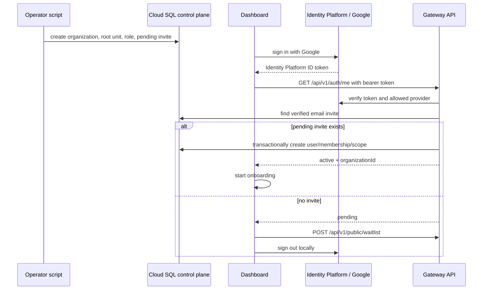
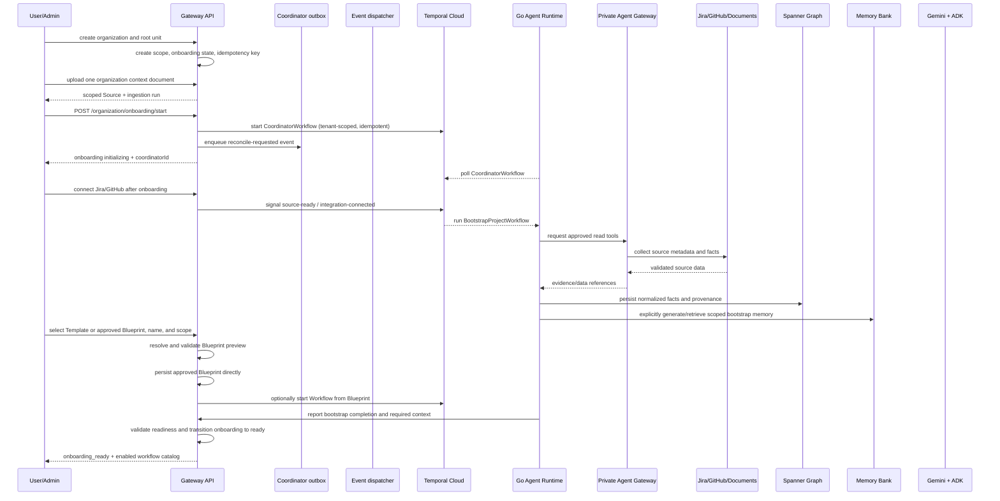
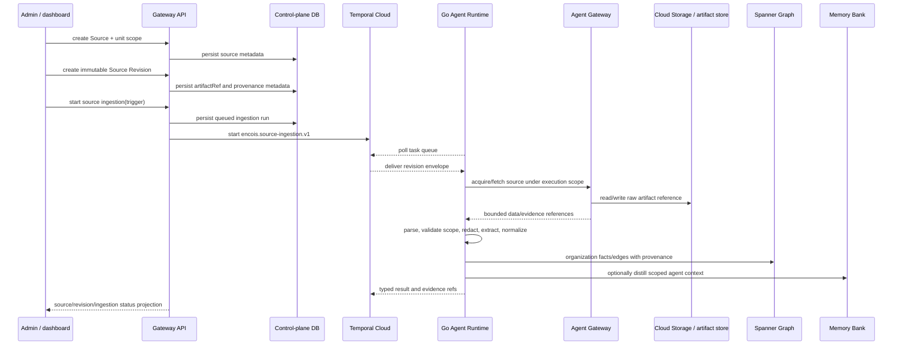
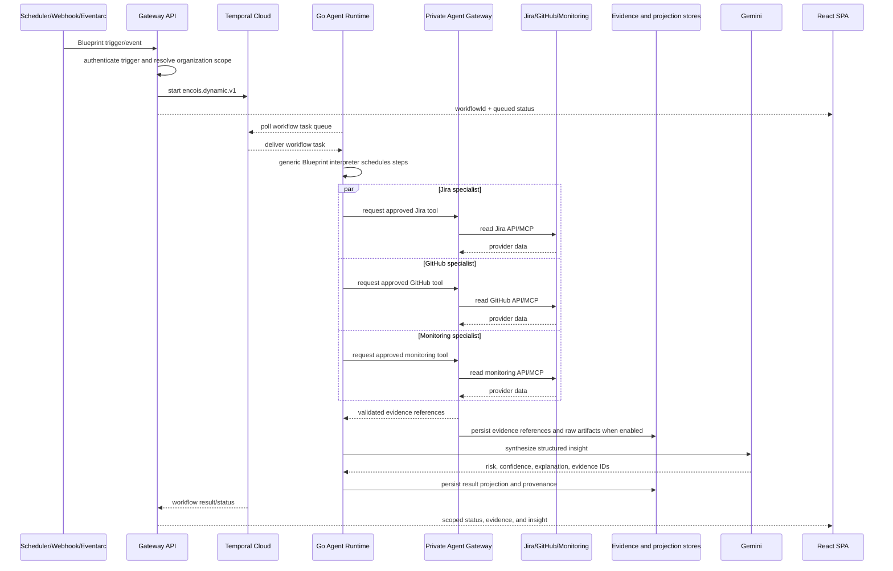
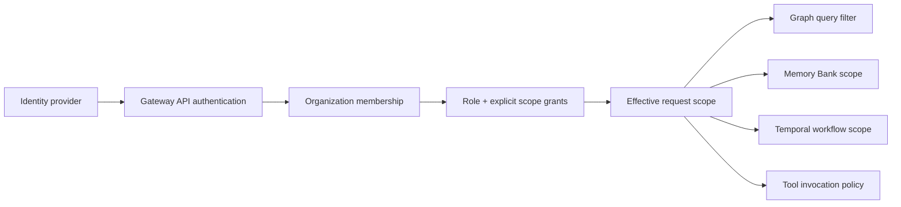

# Encois Product and Runtime Flows

**Status:** proposed final flow baseline with invite-only identity slice implemented

This document describes what a person sees and what the system does. It complements [`architecture.md`](architecture.md), which defines the components and deployment model.

The current repository implements the generic Workflow Blueprint skeleton,
invite-only Identity Platform access, API-backed onboarding and workflow
projections, and read-only Graph/Memory inspection boundaries. Local provider,
Graph, Memory Bank, and model adapters are explicit fixtures; hosted services
and provider authorization remain deployment boundaries rather than being
represented as browser state.

Cross-language payloads and generation rules are defined in [`contracts.md`](contracts.md). The generic MCP/ADK/Temporal communication model is defined in [`protocols.md`](protocols.md). The public API uses OpenAPI; Temporal and private Agent Gateway payloads use versioned JSON Schema.

## 1. Shared flow rules

- Every flow begins with an authenticated actor or an approved system trigger.
- The Gateway API resolves organization and effective scope before data is loaded.
- The Dashboard calls API projections for product state; it does not fabricate missing records, statuses, IDs, or onboarding progress.
- Long-running work is a Temporal Workflow and returns a `workflowId`/`investigationId`.
- Agents delegate only to approved Agent Definitions and call tools only through the Agent Gateway.
- Temporal owns execution state, waits, retries, Signals, and recovery.
- Memory Bank owns scoped agent context; Spanner Graph owns shared company relationships and normalized facts.
- Every conclusion distinguishes observed facts, model inference, and recommendation.
- Every visible conclusion has evidence IDs, source timestamps, freshness, confidence, and limitations.
- The dashboard calls the scoped graph surface **Organization context**; an organization unit is a scope node, not a separate product hierarchy.
- An organization that is not `ready` remains in onboarding and cannot use tenant product routes; a missing onboarding record is a data/readiness error.
- External writes are disabled in the MVP.

Background intelligence uses three triggers:

```text
provider webhook/event -> fast incremental update
Temporal Schedule/timer -> periodic reconciliation
manual query            -> on-demand investigation
```

The exact cadence is source-specific (for example minutes for production
health, hourly for release health, and daily for full reconciliation). The
Coordinator remains one durable Workflow; it is not a process or server per
agent.

The execution vocabulary is defined in [`dictionary.md`](dictionary.md). In particular, a Worker is a deployable Go process, an Activity is a registered function executed by that Worker, and a specialist Agent is a logical role rather than a separate server.

## 2. Invite-only authentication and access

There is no public signup or email/password flow in the MVP. Google is the only
browser sign-in provider, and a Google identity becomes an Encois user only
after a local pending invite is accepted.



The operator path is intentionally script-based for the first slice:
`auth:bootstrap-organization` creates the first organization and admin invite;
`auth:invite-user` adds later members; `auth:list-waitlist` and
`auth:revoke-invite` support the basic lifecycle. The scripts use the
privileged migration connection and are not browser endpoints.

The Gateway exposes `/api/v1/auth/me` outside the active-membership middleware
so it can distinguish invalid authentication from pending access. All tenant
routes remain protected. A pending user can only see the waitlist experience;
the waitlist requires a plausible work email, company name, and company
website or LinkedIn URL. It does not create an Identity Platform account or
organization membership. The work-email check rejects common personal mailbox
providers but does not prove mailbox ownership; email verification remains a
later hardening step.

## 2.1 Mandatory organization onboarding and Coordinator bootstrap

Every new organization starts with a Coordinator. Onboarding may finish
without a Source, so the dashboard can open with an empty context; useful
read-only intelligence becomes available after Sources are added and ingested.



### Onboarding readiness states

The control plane owns one tenant-scoped onboarding status. The canonical API
values are lower-case: `pending`, `initializing`, `ready`, and `failed`. A
missing `organization_onboarding` row is not a status; it is a data or
migration problem and must not be silently converted into `pending` by the
API or dashboard.

| State | Meaning | Dashboard and API behavior | Next transition |
| --- | --- | --- | --- |
| Missing row | The control plane has no onboarding record for the organization. | Block every ordinary tenant product route and return `ORGANIZATION_ONBOARDING_NOT_FOUND` with HTTP `503`. Do not create a row during `GET /organization`. | Migration, backfill, or an explicit repair flow creates the record. |
| `pending` | The organization exists, but required onboarding configuration or source context is incomplete. | Keep the user in the onboarding surface. Ordinary dashboard reads and product mutations return `ORGANIZATION_ONBOARDING_REQUIRED` with HTTP `409`. | `PATCH /organization/onboarding` updates configuration; `POST /organization/onboarding/start` moves to `initializing`. |
| `initializing` | The Coordinator start was accepted by Temporal and bootstrap/reconciliation is running. | Show progress and status only. Do not expose ordinary dashboard, membership, integration, workflow, or Run mutations. | A scoped Coordinator callback moves the record to `ready` or `failed`. |
| `failed` | Bootstrap or required initial reconciliation failed or was deferred. | Keep the organization in the onboarding recovery surface. An administrator with `onboarding:manage` can clear the failed attempt and start over; other users see that an administrator must resolve setup. | `POST /organization/onboarding/reset` terminates the previous Coordinator execution, marks its control-plane run `cancelled`, clears onboarding selections, and moves to `pending`. The administrator then completes onboarding and starts a new attempt. |
| `ready` | The Coordinator reported successful bootstrap and the API persisted the readiness transition. | Open the normal dashboard and all existing permission-scoped product surfaces. | A later product decision may explicitly return the organization to onboarding; the UI never invents that transition. |

The service-level `GET /health/ready` endpoint is separate from tenant
onboarding readiness. It reports whether the API process and required
dependencies are available; one organization being `pending` or `failed` does
not make the service unhealthy.

Before `ready`, the onboarding exception surface is limited to reading the
organization projection, updating onboarding settings, starting or resetting
the Coordinator, listing active Templates and approved Blueprints, and
registering/uploading/ingesting onboarding Sources. Internal Coordinator
callbacks are service-authenticated and are not browser routes. All other
tenant routes remain behind the readiness gate while the existing permissions
still apply after the gate opens. The initial onboarding browser flow can
upload one organization context document or skip the upload; it does not
select workflow catalog references. Workflow selection is a later explicit
product action; the API
resolves Blueprint revisions, Workflow IDs, Run IDs, and Temporal IDs on the
server.

`POST /organization/onboarding/start` returns `initializing` only after the
Temporal start request is accepted. It does not return `ready` optimistically.
The Coordinator performs one immediate bootstrap reconciliation. With the
initial empty workflow selection, it reports `ready` without creating a
Blueprint; explicitly configured workflow selections use the same direct flow.
Reset is an explicit action and does not
fabricate progress, runs, or readiness.

The Coordinator is a long-lived logical Workflow. It waits on Temporal timers,
Signals, and workflow events; it does not hold a Worker process in memory. A
periodic Temporal Schedule or a source event can wake reconciliation. If a
provider changes from Jira to Linear, the Coordinator proposes a new version,
marks the old workflow for deprecation, and waits for approval when the change
could alter behavior or external side effects. It does not silently delete the
old workflow or copy provider instructions into policy.

Current Runtime boundary: a reconciliation trigger invokes the Coordinator,
which reports readiness through the private Gateway control-plane route.
Blueprint creation and optional Workflow start are handled directly by the
Gateway after deterministic authorization and provider checks. The Coordinator
does not own Blueprint persistence or Workflow creation.

The dashboard gate is deterministic and applies to every tenant route:

```text
missing onboarding row -> block product routes; show a data/migration error
pending                -> show onboarding; reject ordinary tenant routes (409)
initializing           -> show bootstrap progress; reject ordinary routes (409)
failed                 -> show recovery/reset; reject ordinary routes (409)
ready                  -> render the scoped dashboard under existing permissions
```

The authenticated route guard follows the same policy as the API. A missing
row is not treated as an onboarding screen, and a non-admin is not offered a
retry control for a state they cannot manage.

“Coordinator has all memory” means all authorized organization context is
available for discovery. Every underlying read still passes current scope and
policy checks, and secrets remain inside the Agent Gateway.

## 2.2 Coordinator reconciliation loop

```text
CoordinatorWorkflow
  -> perform one immediate bootstrap reconciliation after onboarding start
  -> report ready only after successful required-context validation
  -> report failed when bootstrap is deferred or errors
  -> wait for later onboarding signals, Temporal Schedule, source events, or workflow results
  -> inspect freshness and enabled Integration Packs
  -> decide incremental versus scheduled reconciliation from source freshness budgets
  -> retrieve relevant scoped Graph/Memory Bank references
  -> ask ADK/Gemini for a typed change proposal
  -> validate Blueprint version, step graph, tools, scope, budget, and approval requirements deterministically
  -> Gateway API persists the blueprint/projection
  -> explicit change.start intent decides whether an applied snapshot is started
  -> Coordinator starts the approved snapshot through the private Gateway
  -> wait again
  -> Continue-As-New when history becomes large
```

Temporal can execute only Workflow types registered by a Worker. The creator
selects the pre-registered generic Blueprint Workflow; it cannot invent and
deploy new Go code at runtime. Blueprint creation is therefore configuration
plus validation, not dynamic code generation.

## 2.3 User-created workflow builder

The builder represents a workflow as a versioned directed acyclic graph. For
example, Jira and GitHub steps with no dependency run in parallel, and an email
step depending on both runs afterwards.

```text
POST /v1/workflows/blueprints/preview
  -> authenticate user and resolve organization-unit scope
  -> resolve a Template or approved Blueprint
  -> validate provider capabilities and return the Blueprint preview

POST /v1/workflows/blueprints/from-intent
  -> repeat the same server-side resolution and authorization
  -> persist the approved Blueprint directly
  -> optionally start the Workflow from that Blueprint snapshot
  -> return the created Blueprint and optional Workflow projection

Dashboard lifecycle separation:
  Workflow detail = grouped Blueprint definition by stable blueprintId
  Blueprint detail = one versioned registry family and revision lifecycle
  Workflow deletion = hide the complete definition family
  Blueprint revision deletion = hide one non-current revision only

Temporal start:
  workflowType = encois.dynamic.v1
  input        = validated blueprint + execution context
```

Blueprint rows preserve the resolved version and source identity. Future
Blueprint revisions can add an explicit revision history without introducing a
separate intermediate record.

The Agent Gateway exposes the corresponding private validation and
fixture-level MCP-shaped catalog endpoints, but it intentionally does not
become a second workflow registry or Temporal client. Catalog metadata includes
tool schemas, annotations, version, availability, approval requirements, and
required scope; invocation re-checks the registered capability and scope after
policy authorization. External-write nodes such as `email.send` produce an
approval requirement; the current read-only fixture policy denies it before
execution, and a future write policy must preserve the approval boundary.

## 2.4 Integration and Source ingestion

Workflow Templates and Sources are separate concepts. A Template is a
provider-neutral suggestion for a user-created Blueprint; a Source is an actual,
scoped origin of evidence. An Integration is the organization-level provider
connection, while an integration Source selects the Jira project, GitHub
repository, Slack channel, or similar resource for an organization unit.
Creating a Template never creates an Integration, Source, or ingestion run.



The common flow is deliberately split into source-specific acquisition and a
shared downstream pipeline:

```text
Integration: discover/fetch/webhook/reconcile -> shared pipeline
Uploaded:    artifact reference -> parse/OCR -> shared pipeline
Manual:      validated note/fact -> shared pipeline
Media:       transcript/metadata -> shared pipeline
```

The current implementation persists the first three control-plane records,
accepts a validated PDF upload into the configured Cloud Storage adapter,
exposes source revisions and ingestion runs to the Dashboard, and starts the
registered Runtime Workflow. Local mode uses a deterministic reader/parser and
explicit adapter fixtures; hosted mode reads through Agent Gateway and projects
facts to Spanner plus distilled context to Memory Bank. OCR/transcription and live
Jira/GitHub acquisition remain provider-specific adapters.

## 2. Request-to-worker flow

The normal path from a dashboard action to running code is:

```text
React SPA
  -> Gateway API
  -> Temporal Client in the API
  -> Temporal Cloud Workflow ID and task queue
  -> Go Agent Runtime Worker polling the task queue
  -> Workflow and Activities
  -> private Agent Gateway
  -> API/MCP Integration
```

For Workflow creation, the control path is deliberately direct:

```text
User / Workflow Creator
  -> GET /api/v1/workflows/templates
  -> resolve a provider-neutral template and provider slots
  -> preview the resolved Blueprint
  -> persist the approved Blueprint snapshot
  -> optionally start a Workflow from that snapshot
  -> coordinator-event.v1 via transactional outbox
  -> CoordinatorWorkflow
  -> private Gateway start Activity, only when change.start exists
  -> Temporal: encois.dynamic.v1
```

Temporal Cloud stores the Workflow history and schedules tasks. It does not execute Go code. The Go Agent Runtime opens the connection and polls the task queue. The Gateway API starts and controls the Workflow but does not execute long Gemini or provider calls inside the HTTP request.

The Agent Gateway is a private east-west service (or an equivalent in-process Go module for the first slice); it is not a browser-facing route. The Go Runtime sends it a small, validated execution context rather than fetching control-plane data from Postgres. In Cloud Run, the request carries a platform ID token for the Gateway audience plus a separate Encois service token; local smoke uses the application token directly.

For any company-specific Blueprint, use a stable business ID such as:

```text
workflow:acme:release-readiness:checkout:aug-30
```

The Gateway API uses `SignalWithStart` or an equivalent idempotent start rule. If the Workflow is already running, the request is attached to the existing execution or returns its current projection. This prevents repeated clicks from creating duplicate work for the same Blueprint and business key.

## 3. Scheduled or event-triggered Blueprint execution



The Go runtime does not pass large raw provider responses between agents. Activities persist or reference evidence, and agents exchange small structured results.
Graph facts and Agent Memory are optional later projections of the same evidence and result contracts.

## 3.1 Communication, policy, and data flow

Every external read follows the same boundary sequence:

```text
1. Gateway API authenticates the actor and computes effective organization scope.
2. Gateway API starts/signals Temporal with a versioned execution context.
3. Go Runtime polls Temporal and runs the Workflow/Activity.
4. Activity asks the private Agent Gateway for a registered tool.
5. Agent Gateway validates tool, actor, scope, integration grant, policy version,
   host, method, timeout, and payload limits.
6. Agent Gateway resolves a short-lived credential and calls the provider API/MCP.
7. Raw response is stored in Cloud Storage when needed; normalized facts go to
   Spanner Graph; selective agent context goes to Memory Bank.
8. Activity returns IDs/references and a small normalized result to the Workflow.
9. Gateway API reads the safe projection and React renders it.
```

The last policy check happens in the Agent Gateway immediately before the external call. For a revoked permission or disabled integration, the call stops there and the Workflow receives a typed policy/capability error. For a sensitive or future write operation, the gateway re-checks current policy even if the Workflow has an older policy snapshot.

The Runtime already sends the selected Workflow scope in the execution context,
so the existing Agent Gateway policy check can reject an out-of-scope tool
request. The remaining production hardening is deterministic credential
selection: pass that execution scope into the private resolver and require the
selected Integration binding to cover the complete requested scope instead of
choosing the first matching provider connection.

The data ownership is deliberately split:

```text
Temporal        = execution state, retries, waits, Signals, references
Cloud Storage   = raw provider snapshots and large artifacts
Spanner Graph   = normalized company entities, facts, edges, provenance
Memory Bank     = selective agent-specific semantic memory
Gateway API DB  = control-plane registry, projections, memberships, audit
```

If the Gateway API uses Postgres and Drizzle, only the TypeScript control plane owns that database and its migrations. The Go Runtime does not query it. It receives IDs, scope, policy version, and data references through contracts.

## 4. Example Blueprint: release readiness with missing context

Example request:

```text
User: “Чи зробимо ми реліз до кінця тижня?”
```

### 4.1 Start or reuse

```text
React sends POST /v1/workflows
  -> Gateway API authenticates actor and resolves scope
  -> API derives workflow:acme:release-readiness:next-release
  -> API uses SignalWithStart in Temporal Cloud
  -> existing active execution is reused, or a new generic Workflow starts
  -> API returns workflowId and status
```

The Workflow ID is the logical investigation. A Temporal Run ID is one execution of that Workflow. A refresh can continue the existing Workflow, use `continue-as-new`, or start a child run while preserving one user-facing investigation.

### 4.2 Missing release

The first Blueprint step, `resolve-context`, checks configured integrations and
existing projections. A later implementation may use Graph or Memory Bank as
additional context sources.

```text
Release found
  -> continue to the Blueprint's specialist/tool steps

Release not found
  -> Workflow state = WAITING_FOR_INPUT
  -> reason = RELEASE_NOT_FOUND
  -> Gateway API exposes requiredInput to React
  -> Workflow waits for context-provided Signal
```

This is a business pause, not a retryable infrastructure error. The UI can ask the user to select a Jira release, enter a project and target date, or cancel the investigation.

If the user wants Encois to create a Jira release, that is a separate write
operation requiring explicit approval. The MVP may instead save the context in
Encois and continue in read-only mode.

### 4.3 Resume the same Workflow

```text
User supplies release context
  -> React sends POST /v1/workflows/:id/signals
  -> Gateway API validates actor and payload
  -> API sends context-provided Signal
  -> Temporal wakes the existing Workflow
  -> Workflow checks evidence freshness
  -> only missing or stale Activities run
  -> independent Blueprint steps execute in parallel
```

The system does not create a new agent process after the pause. The same Go Worker can execute the resumed Workflow, potentially on a different container instance after a restart.

## 5. Natural-language question

Example: “Are we on track for the August 30 release, and what changed after yesterday’s deployment?”

```text
User
  -> React sends question to Gateway API
  -> API authenticates user and resolves scope
  -> API starts or queries a generic Temporal Workflow
  -> Go Agent Runtime Worker polls and executes the Workflow
  -> ADK agent step uses permitted tools through Agent Gateway
  -> Activities return bounded evidence and redacted trace references; Graph/Memory are optional later stores
  -> Gemini produces structured answer
  -> API returns answer + graph path + evidence + freshness
  -> React renders the answer and workflow progress
```

If fresh evidence already exists, the workflow can answer quickly. If evidence is missing or stale, the same query becomes an asynchronous investigation. The UI must make that distinction visible.

## 6. Specialist and integration flow

A specialist is a logical agent definition. An Integration Pack provides the connector and tools. The MVP does not deploy one server per specialist or repository.

```text
encois.dynamic.v1
  -> tool step: jira.search_issues
  -> tool step: github.search_pull_requests
  -> tool step: monitoring.query_errors
  -> agent step: context-synthesizer
```

The same Go Worker deployment can execute all these Workflow and Activity instances. A separate Worker deployment is introduced only when operational isolation or independent scaling justifies it.

When a required capability is not installed:

```text
Workflow asks Registry for github.issues.read
  -> capability unavailable
  -> Workflow state = WAITING_FOR_CAPABILITY
  -> UI shows “Install or connect GitHub Issues Pack”
  -> administrator enables a versioned Pack
  -> API sends capability-enabled Signal
  -> same Workflow resumes
```

The Registry reports approved definitions and capabilities. It does not represent running processes.

## 7. Waiting and resuming

### Waiting for permissions or human approval

```text
ADK agent requests a sensitive operation
  -> Temporal Workflow enters waiting state
  -> Gateway API shows approval request to authorized user
  -> user approves or rejects
  -> API sends Temporal Signal
  -> same Workflow resumes
  -> Activity executes only after policy re-check
```

### Waiting for an external status

```text
Temporal Workflow starts a wait
  -> Jira/GitHub/monitoring webhook arrives
  -> Gateway API verifies signature and scope
  -> API sends correlated Temporal Signal
  -> Workflow resumes from the wait point
```

If a provider has no webhook, a Temporal timer can schedule bounded polling. A new agent is not created for every check.

All source reads carry `observedAt`, `ingestedAt`, source identity, and a freshness
status (`fresh`, `stale`, or `unknown`). Source-specific budgets decide whether
the Coordinator can use the data, should mark the result degraded, or should
schedule reconciliation. A stale result must remain visibly stale in the UI.

The local harness verifies this same control shape with a generic approval
Blueprint: the Workflow reaches a running wait, the API sends the authorized
Signal, and the existing Go Worker resumes the same execution. The hosted
implementation still needs Temporal Cloud and Cloud Run validation.

## 8. Integration Pack installation

```text
Admin opens Integrations
  -> selects a pack and reviews requested scopes
  -> Gateway API validates the pack version and organization policy
  -> credential flow stores a Secret Manager reference
  -> connector health check runs with the granted scope
  -> pack becomes enabled only after the check succeeds
  -> Agent Registry exposes tools and specialist definitions
  -> private Agent Gateway receives the enabled pack policy and connector binding
  -> scheduled sync or webhook ingestion begins
```

The UI shows connection state, granted scope, last successful read, last error, and exposed data types. It never shows raw tokens.

An organization-level Integration can be reused by descendant units, so a unit
manager does not create another Secret Manager credential just to add a Source
for that unit. The API checks the manager's effective unit scope, the active
Integration capability, and the Source's hierarchy coverage; selecting a unit
in the Dashboard only narrows the server-side projection and never grants
access. Resource-specific repository/project/channel configuration belongs on
the unit-scoped Source contract, not in browser-held credentials.

For a connector without a usable API, a browser worker may be introduced later. It follows the same pack contract and policy boundary; it is not a way around authorization.

## 9. Organization and permissions flow



Example: a Team A manager may read Team A and explicitly shared dependencies. The organization tree itself is returned as structural metadata so the UI can show the complete hierarchy, but unit details, members, sources, graph facts, and workflow data remain scoped to the caller. A company-level lead may see Departments A, B, and C. A specialist receives only the intersection of user scope, workflow scope, agent policy, and connector grant.

The server computes this scope for every request, graph query, memory retrieval, and tool call. A client-supplied `organizationId`, organization-unit ID, or “admin” flag is never trusted. Authorization uses one canonical organization-unit ID set; team and project are organization-unit types, not separate scope namespaces.

The effective scope is deterministic and tree-aware:

```text
direct membership roots -> inherited descendants
explicit grants         -> additional descendants
explicit restrictions   -> subtract restricted descendants
```

The current API computes inheritance from the organization-unit tree and
exposes Gateway-backed organization-unit and direct membership permission
administration. Persisted grant/restriction rules remain a later control-plane
extension; direct membership scopes are the current durable input.

Access escalation is a separate, self-service request flow: an active member
can request viewer, contributor, or manager access for a unit already visible
in their effective scope. The Gateway persists the request and audit event;
only a different organization administrator can approve or reject it, and a
second explicit apply step writes the membership scope. Administrator role
permissions are never granted by this flow. Structural tree visibility does
not grant access to the unit's data or make it selectable in scoped queries.

### Memory governance flow

```text
Authorized user opens Memory
  -> API loads only agent memories within the effective organization scope
  -> user proposes an addition, correction, or deletion
  -> API validates agent, project/user scope, evidence references, and redaction boundary
  -> Review queue records the proposed change and audit event
  -> a separately authorized reviewer approves or rejects it
  -> an explicit apply step re-checks scope and policy
  -> Agent Runtime executes the bounded Memory Bank operation
  -> API records provider operation, resulting memory ID, status, and failure reason
```

Memory additions are distillations of user-supplied facts plus evidence
references; they do not create a reusable Template or modify a Workflow.
The dashboard deliberately exposes governed add/correct/delete operations,
while provider-specific actions such as reindexing, pinning, and bulk export
remain deferred until their authorization and retention contracts exist.

## 10. Coordinator recommendation lifecycle

```text
Dashboard requests /investigations/recommendations
  -> Gateway resolves the caller, organization, permissions, and scope
  -> Gateway derives candidates from scoped Integrations, Sources, and Workflows
  -> current candidates are upserted as user-scoped recommendation projections
  -> disappeared candidates become RESOLVED; returning candidates reopen
  -> Dashboard shows only OPEN items as Next actions
  -> user follows the allowlisted target and may Accept or Dismiss
  -> Gateway persists the state transition and writes an audit event
```

Recommendation generation is deterministic and permission-aware. It must not
invent counts outside the caller's scope or turn an unavailable dependency
into a false "no action" state. Blueprint creation and Coordinator onboarding
remain a separate contract boundary.

## 11. Canvas and observability flow

The canvas is a projection of Temporal execution, Spanner Graph relationships, and safe telemetry. It is not a second execution engine.

```text
Gateway API loads:
  - organization graph from Spanner Graph
  - workflow visibility from Temporal
  - safe agent/memory references from the control plane

React renders:
  - Company / Department / Team / Project structure
  - graph paths between risks and owners
  - active workflows and specialist branches
  - queued, running, waiting, partial, degraded, failed, and completed states
  - status reason, retry/freshness context, and missing capability/approval state
  - evidence, timestamps, retries, Signals, Activities, and trace links
```

The first canvas may show a release-readiness Blueprint and its tool/agent
steps. A full free-form graph editor is deferred; the initial goal is
operational understanding.

## 12. Failure, retry, and recovery

```text
Activity fails
  -> Temporal applies timeout and retry policy
  -> failure is classified: auth | rate-limit | timeout | provider | validation | policy
  -> completed Activities are not re-run
  -> retryable Activity is retried with bounded backoff
  -> missing credentials/capability becomes WAITING_FOR_CAPABILITY
  -> approval requirement becomes WAITING_FOR_APPROVAL
  -> provider failure with usable evidence becomes DEGRADED/PARTIAL
  -> permanent invalid input becomes FAILED
  -> reason code, retry context, and stale evidence are visible in the workflow
  -> user/operator may cancel or signal a recovery path
```

Activities that call external systems must be idempotent. Large payloads and sensitive data should be stored outside Temporal history and referenced by ID.

## 13. First UI contract

The first vertical slice needs these API-level projections:

- `GET /overview` — scoped health, active workflows, warnings, freshness.
- `GET /workflows/:id` — workflow status, steps, evidence references, result, and errors.
- `POST /workflows` — start a user-requested Blueprint execution.
- `POST /workflows/:id/signals` — send an authorized approval or external-event Signal.
- `POST /workflows/:id/updates` — apply an authorized, versioned update to the active Workflow context.
- `POST /queries` — start a bounded question or return a fresh answer.
- `GET /agents` — approved definitions and current activity projection.
- `GET /integrations` — packs, health, granted scopes, and last sync.
- `GET /org` — hierarchy and permitted scope projection.
- `GET /graph/paths` — scoped relationship paths for canvas and evidence explanations.

These are intent-level contracts, not all final routes. The public vertical-slice contracts are now versioned in `packages/contracts`; future routes must extend the same OpenAPI/JSON Schema boundary rather than introducing app-local cross-language DTOs.

Current Dashboard coverage is intentionally narrower: it consumes workflow
list/start/detail projections and integration list/update projections through
the authenticated Gateway client. Overview, workflow events, evidence
history, freshness, agent activity, organization hierarchy, graph paths, and
query routes remain future projections; the Dashboard must show an explicit
unavailable state until their Gateway contracts exist.

## 14. Product boundary for the MVP

Included:

- one organization hierarchy;
- synthetic or authorized GitHub, Jira, and monitoring data;
- scheduled or event-triggered company-specific Blueprint execution;
- delegated read-only specialists in Go ADK;
- Temporal durable execution with waits, retries, Signals, and parallel branches;
- evidence-backed dashboard, canvas projection, and natural-language query using control-plane projections;
- visible logs/traces and bounded failures.

Deferred:

- autonomous writes to Jira, GitHub, Slack, or infrastructure;
- arbitrary user-created agents;
- unrestricted browser automation;
- a marketplace for third-party packs;
- customer-specific physical deployment;
- enterprise SSO and complex policy administration;
- advanced graph algorithms and full GraphRAG document pipelines;
- live provider acquisition and production-grade Memory Bank/Spanner quality,
  retention, and deletion controls;
