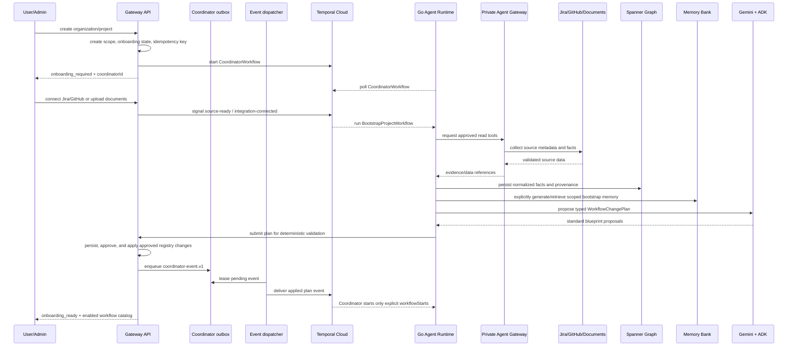
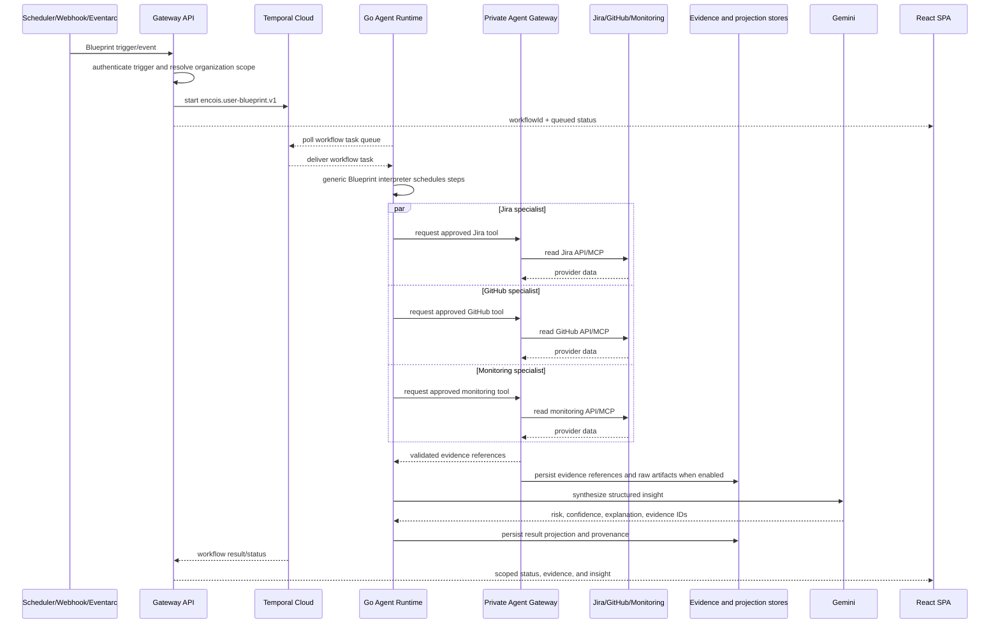
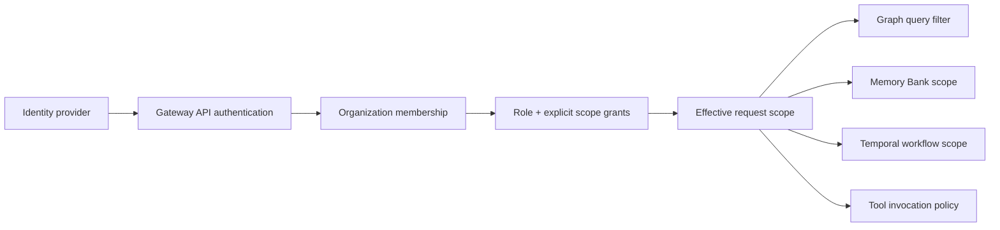

# Encois Product and Runtime Flows

**Status:** proposed final flow baseline

This document describes what a person sees and what the system does. It complements [`architecture.md`](architecture.md), which defines the components and deployment model.

The current repository implements the generic Workflow Blueprint skeleton and
synthetic Agent Gateway tools. The flows below describe the target behavior as
well as the current direction; real authentication, provider APIs, Graph,
Memory Bank, and production policy enforcement are intentionally marked as
later steps rather than treated as implemented.

Cross-language payloads and generation rules are defined in [`contracts.md`](contracts.md). The generic MCP/ADK/Temporal communication model is defined in [`protocols.md`](protocols.md). The public API uses OpenAPI; Temporal and private Agent Gateway payloads use versioned JSON Schema.

## 1. Shared flow rules

- Every flow begins with an authenticated actor or an approved system trigger.
- The Gateway API resolves organization and effective scope before data is loaded.
- Long-running work is a Temporal Workflow and returns a `workflowId`/`investigationId`.
- Agents delegate only to approved Agent Definitions and call tools only through the Agent Gateway.
- Temporal owns execution state, waits, retries, Signals, and recovery.
- Memory Bank owns scoped agent context; Spanner Graph owns shared company relationships and normalized facts.
- Every conclusion distinguishes observed facts, model inference, and recommendation.
- Every visible conclusion has evidence IDs, source timestamps, freshness, confidence, and limitations.
- External writes are disabled in the MVP.

Background intelligence uses three triggers:

```text
provider webhook/event -> fast incremental update
Temporal Schedule/timer -> periodic reconciliation
manual query            -> on-demand investigation
```

The exact cadence is source-specific (for example minutes for production
health, hourly for release health, and daily for full reconciliation). The
Coordinator remains one durable Workflow; it is not a process or server per
agent.

The execution vocabulary is defined in [`dictionary.md`](dictionary.md). In particular, a Worker is a deployable Go process, an Activity is a registered function executed by that Worker, and a specialist Agent is a logical role rather than a separate server.

## 2.1 Mandatory onboarding and Coordinator bootstrap

Every new organization or project starts with a Coordinator, but it does not
become dashboard-ready until onboarding produces enough context for useful
read-only intelligence.



The Coordinator is a long-lived logical Workflow. It waits on Temporal timers,
Signals, and workflow events; it does not hold a Worker process in memory. A
periodic Temporal Schedule or a source event can wake reconciliation. If a
provider changes from Jira to Linear, the Coordinator proposes a new version,
marks the old workflow for deprecation, and waits for approval when the change
could alter behavior or external side effects. It does not silently delete the
old workflow or copy provider instructions into policy.

Current Runtime boundary: a reconciliation trigger invokes a Go Activity that
proposes a validated `workflow-change-plan.v1`, followed by a separate Activity
that submits it to the private Gateway control-plane route. Approval
notification uses the separate `coordinator-event.v1` envelope, whose Runtime
receiver now deduplicates and scope-checks events. Gateway approval/application
transactionally enqueue the event in the outbox. Outbox delivery has a bounded
lease/retry implementation and a one-shot dispatcher entrypoint. Applying an
approved plan emits `workflowStarts` only for explicit change-level `start`
intents; the Coordinator starts those approved snapshots through its private
Gateway Activity and retains failed starts for retry. Scheduler invocation and
hosted delivery remain deployment work.

The dashboard gate is deterministic:

```text
onboarding state != READY -> show setup/progress and missing context
onboarding state == READY  -> show scoped dashboard and proposed workflows
```

“Coordinator has all memory” means all authorized project/org context is
available for discovery. Every underlying read still passes current scope and
policy checks, and secrets remain inside the Agent Gateway.

## 2.2 Coordinator reconciliation loop

```text
CoordinatorWorkflow
  -> wait for onboarding signal, Temporal Schedule, source event, or workflow result
  -> inspect freshness and enabled Integration Packs
  -> decide incremental versus scheduled reconciliation from source freshness budgets
  -> retrieve relevant scoped Graph/Memory Bank references
  -> ask ADK/Gemini for a typed change proposal
  -> validate Blueprint version, step graph, tools, scope, budget, and approval requirements deterministically
  -> Gateway API persists the blueprint/projection
  -> explicit change.start intent decides whether an applied snapshot is started
  -> Coordinator starts the approved snapshot through the private Gateway
  -> wait again
  -> Continue-As-New when history becomes large
```

Temporal can execute only Workflow types registered by a Worker. The creator
selects the pre-registered generic Blueprint Workflow; it cannot invent and
deploy new Go code at runtime. Blueprint creation is therefore configuration
plus validation, not dynamic code generation.

## 2.3 User-created workflow builder

The builder represents a workflow as a versioned directed acyclic graph. For
example, Jira and GitHub steps with no dependency run in parallel, and an email
step depending on both runs afterwards.

```text
POST /v1/workflows (Gateway API)
  -> authenticate user and resolve organization/project scope
  -> send blueprint to private Agent Gateway for capability and permission validation
  -> persist draft/version in the control plane
  -> create or update the Temporal execution/schedule
  -> return workflowId and permission/approval requirements

Workflow Creator proposal preview:

POST /v1/workflows/plans/validate
  -> validate workflow-change-plan.v1
  -> enforce tenant and required-scope ownership
  -> return validated_not_applied
  -> POST /v1/workflows/plans persists the proposal when Postgres is configured
  -> POST /v1/workflows/plans/:planId/approve records explicit approval
  -> POST /v1/workflows/plans/:planId/apply persists an approved Blueprint revision
  -> API enqueues coordinator-event.v1 transactionally
  -> Coordinator receives workflowStarts for changes that explicitly requested start
  -> Coordinator starts the immutable approved snapshot through the private Gateway
  -> update/deprecate changes without start only change the registry; cancel-only plans cancel targeted Temporal executions

Temporal start:
  workflowType = encois.user-blueprint.v1
  input        = validated blueprint + execution context
```

The Agent Gateway exposes the corresponding private validation and
fixture-level MCP-shaped catalog endpoints, but it intentionally does not
become a second workflow registry or Temporal client. Catalog metadata includes
tool schemas, annotations, version, availability, approval requirements, and
required scope; invocation re-checks the registered capability and scope after
policy authorization. External-write nodes such as `email.send` produce an
approval requirement; the current read-only fixture policy denies it before
execution, and a future write policy must preserve the approval boundary.

## 2. Request-to-worker flow

The normal path from a dashboard action to running code is:

```text
React SPA
  -> Gateway API
  -> Temporal Client in the API
  -> Temporal Cloud Workflow ID and task queue
  -> Go Agent Runtime Worker polling the task queue
  -> Workflow and Activities
  -> private Agent Gateway
  -> API/MCP Integration
```

For a Workflow Creator plan, the control path is deliberately separate:

```text
Workflow Creator
  -> validate/submit plan
  -> human approval
  -> apply immutable registry snapshot
  -> coordinator-event.v1 via transactional outbox
  -> CoordinatorWorkflow
  -> private Gateway start Activity, only when change.start exists
  -> Temporal: encois.user-blueprint.v1
```

Temporal Cloud stores the Workflow history and schedules tasks. It does not execute Go code. The Go Agent Runtime opens the connection and polls the task queue. The Gateway API starts and controls the Workflow but does not execute long Gemini or provider calls inside the HTTP request.

The Agent Gateway is a private east-west service (or an equivalent in-process Go module for the first slice); it is not a browser-facing route. The Go Runtime sends it a small, validated execution context rather than fetching control-plane data from Postgres. In Cloud Run, the request carries a platform ID token for the Gateway audience plus a separate Encois service token; local smoke uses the application token directly.

For any company-specific Blueprint, use a stable business ID such as:

```text
workflow:acme:release-readiness:checkout:aug-30
```

The Gateway API uses `SignalWithStart` or an equivalent idempotent start rule. If the Workflow is already running, the request is attached to the existing execution or returns its current projection. This prevents repeated clicks from creating duplicate work for the same Blueprint and business key.

## 3. Scheduled or event-triggered Blueprint execution



The Go runtime does not pass large raw provider responses between agents. Activities persist or reference evidence, and agents exchange small structured results.
Graph facts and Agent Memory are optional later projections of the same evidence and result contracts.

## 3.1 Communication, policy, and data flow

Every external read follows the same boundary sequence:

```text
1. Gateway API authenticates the actor and computes effective organization scope.
2. Gateway API starts/signals Temporal with a versioned execution context.
3. Go Runtime polls Temporal and runs the Workflow/Activity.
4. Activity asks the private Agent Gateway for a registered tool.
5. Agent Gateway validates tool, actor, scope, integration grant, policy version,
   host, method, timeout, and payload limits.
6. Agent Gateway resolves a short-lived credential and calls the provider API/MCP.
7. Raw response is stored in Cloud Storage when needed; normalized facts go to
   Spanner Graph; selective agent context goes to Memory Bank.
8. Activity returns IDs/references and a small normalized result to the Workflow.
9. Gateway API reads the safe projection and React renders it.
```

The last policy check happens in the Agent Gateway immediately before the external call. For a revoked permission or disabled integration, the call stops there and the Workflow receives a typed policy/capability error. For a sensitive or future write operation, the gateway re-checks current policy even if the Workflow has an older policy snapshot.

The data ownership is deliberately split:

```text
Temporal        = execution state, retries, waits, Signals, references
Cloud Storage   = raw provider snapshots and large artifacts
Spanner Graph   = normalized company entities, facts, edges, provenance
Memory Bank     = selective agent-specific semantic memory
Gateway API DB  = control-plane registry, projections, memberships, audit
```

If the Gateway API uses Postgres and Drizzle, only the TypeScript control plane owns that database and its migrations. The Go Runtime does not query it. It receives IDs, scope, policy version, and data references through contracts.

## 4. Example Blueprint: release readiness with missing context

Example request:

```text
User: “Чи зробимо ми реліз до кінця тижня?”
```

### 4.1 Start or reuse

```text
React sends POST /v1/workflows
  -> Gateway API authenticates actor and resolves scope
  -> API derives workflow:acme:release-readiness:next-release
  -> API uses SignalWithStart in Temporal Cloud
  -> existing active execution is reused, or a new generic Workflow starts
  -> API returns workflowId and status
```

The Workflow ID is the logical investigation. A Temporal Run ID is one execution of that Workflow. A refresh can continue the existing Workflow, use `continue-as-new`, or start a child run while preserving one user-facing investigation.

### 4.2 Missing release

The first Blueprint step, `resolve-context`, checks configured integrations and
existing projections. A later implementation may use Graph or Memory Bank as
additional context sources.

```text
Release found
  -> continue to the Blueprint's specialist/tool steps

Release not found
  -> Workflow state = WAITING_FOR_INPUT
  -> reason = RELEASE_NOT_FOUND
  -> Gateway API exposes requiredInput to React
  -> Workflow waits for context-provided Signal
```

This is a business pause, not a retryable infrastructure error. The UI can ask the user to select a Jira release, enter a project and target date, or cancel the investigation.

If the user wants Encois to create a Jira release, that is a separate write
operation requiring explicit approval. The MVP may instead save the context in
Encois and continue in read-only mode.

### 4.3 Resume the same Workflow

```text
User supplies release context
  -> React sends POST /v1/workflows/:id/signals
  -> Gateway API validates actor and payload
  -> API sends context-provided Signal
  -> Temporal wakes the existing Workflow
  -> Workflow checks evidence freshness
  -> only missing or stale Activities run
  -> independent Blueprint steps execute in parallel
```

The system does not create a new agent process after the pause. The same Go Worker can execute the resumed Workflow, potentially on a different container instance after a restart.

## 5. Natural-language question

Example: “Are we on track for the August 30 release, and what changed after yesterday’s deployment?”

```text
User
  -> React sends question to Gateway API
  -> API authenticates user and resolves scope
  -> API starts or queries a generic Temporal Workflow
  -> Go Agent Runtime Worker polls and executes the Workflow
  -> ADK agent step uses permitted tools through Agent Gateway
  -> Activities persist evidence references; Graph/Memory are optional later stores
  -> Gemini produces structured answer
  -> API returns answer + graph path + evidence + freshness
  -> React renders the answer and workflow progress
```

If fresh evidence already exists, the workflow can answer quickly. If evidence is missing or stale, the same query becomes an asynchronous investigation. The UI must make that distinction visible.

## 6. Specialist and integration flow

A specialist is a logical agent definition. An Integration Pack provides the connector and tools. The MVP does not deploy one server per specialist or repository.

```text
encois.user-blueprint.v1
  -> tool step: jira.search_issues
  -> tool step: github.search_pull_requests
  -> tool step: monitoring.query_errors
  -> agent step: context-synthesizer
```

The same Go Worker deployment can execute all these Workflow and Activity instances. A separate Worker deployment is introduced only when operational isolation or independent scaling justifies it.

When a required capability is not installed:

```text
Workflow asks Registry for github.issues.read
  -> capability unavailable
  -> Workflow state = WAITING_FOR_CAPABILITY
  -> UI shows “Install or connect GitHub Issues Pack”
  -> administrator enables a versioned Pack
  -> API sends capability-enabled Signal
  -> same Workflow resumes
```

The Registry reports approved definitions and capabilities. It does not represent running processes.

## 7. Waiting and resuming

### Waiting for permissions or human approval

```text
ADK agent requests a sensitive operation
  -> Temporal Workflow enters waiting state
  -> Gateway API shows approval request to authorized user
  -> user approves or rejects
  -> API sends Temporal Signal
  -> same Workflow resumes
  -> Activity executes only after policy re-check
```

### Waiting for an external status

```text
Temporal Workflow starts a wait
  -> Jira/GitHub/monitoring webhook arrives
  -> Gateway API verifies signature and scope
  -> API sends correlated Temporal Signal
  -> Workflow resumes from the wait point
```

If a provider has no webhook, a Temporal timer can schedule bounded polling. A new agent is not created for every check.

All source reads carry `observedAt`, `ingestedAt`, source identity, and a freshness
status (`fresh`, `stale`, or `unknown`). Source-specific budgets decide whether
the Coordinator can use the data, should mark the result degraded, or should
schedule reconciliation. A stale result must remain visibly stale in the UI.

The local harness verifies this same control shape with a generic approval
Blueprint: the Workflow reaches a running wait, the API sends the authorized
Signal, and the existing Go Worker resumes the same execution. The hosted
implementation still needs Temporal Cloud and Cloud Run validation.

## 8. Integration Pack installation

```text
Admin opens Integrations
  -> selects a pack and reviews requested scopes
  -> Gateway API validates the pack version and organization policy
  -> credential flow stores a Secret Manager reference
  -> connector health check runs with the granted scope
  -> pack becomes enabled only after the check succeeds
  -> Agent Registry exposes tools and specialist definitions
  -> private Agent Gateway receives the enabled pack policy and connector binding
  -> scheduled sync or webhook ingestion begins
```

The UI shows connection state, granted scope, last successful read, last error, and exposed data types. It never shows raw tokens.

For a connector without a usable API, a browser worker may be introduced later. It follows the same pack contract and policy boundary; it is not a way around authorization.

## 9. Organization and permissions flow



Example: a Team A manager may see Team A and explicitly shared dependencies. A company-level lead may see Departments A, B, and C. A specialist receives only the intersection of user scope, workflow scope, agent policy, and connector grant.

The server computes this scope for every request, graph query, memory retrieval, and tool call. A client-supplied `organizationId`, `teamId`, or “admin” flag is never trusted.

The effective scope is deterministic and tree-aware:

```text
direct membership roots -> inherited descendants
explicit grants         -> additional descendants
explicit restrictions   -> subtract restricted descendants
```

The current API computes inheritance from the organization-unit tree. Persisted
grant/restriction rules are the next control-plane permission migration; until
then direct membership scopes are the only durable input.

## 10. Canvas and observability flow

The canvas is a projection of Temporal execution, Spanner Graph relationships, and safe telemetry. It is not a second execution engine.

```text
Gateway API loads:
  - organization graph from Spanner Graph
  - workflow visibility from Temporal
  - safe agent/memory references from the control plane

React renders:
  - Company / Department / Team / Project structure
  - graph paths between risks and owners
  - active workflows and specialist branches
  - queued, running, waiting, partial, degraded, failed, and completed states
  - status reason, retry/freshness context, and missing capability/approval state
  - evidence, timestamps, retries, Signals, Activities, and trace links
```

The first canvas may show a release-readiness Blueprint and its tool/agent
steps. A full free-form graph editor is deferred; the initial goal is
operational understanding.

## 11. Failure, retry, and recovery

```text
Activity fails
  -> Temporal applies timeout and retry policy
  -> failure is classified: auth | rate-limit | timeout | provider | validation | policy
  -> completed Activities are not re-run
  -> retryable Activity is retried with bounded backoff
  -> missing credentials/capability becomes WAITING_FOR_CAPABILITY
  -> approval requirement becomes WAITING_FOR_APPROVAL
  -> provider failure with usable evidence becomes DEGRADED/PARTIAL
  -> permanent invalid input becomes FAILED
  -> reason code, retry context, and stale evidence are visible in the workflow
  -> user/operator may cancel or signal a recovery path
```

Activities that call external systems must be idempotent. Large payloads and sensitive data should be stored outside Temporal history and referenced by ID.

## 12. First UI contract

The first vertical slice needs these API-level projections:

- `GET /overview` — scoped health, active workflows, warnings, freshness.
- `GET /workflows/:id` — workflow status, steps, evidence references, result, and errors.
- `POST /workflows` — start a user-requested Blueprint execution.
- `POST /workflows/:id/signals` — send an authorized approval or external-event Signal. Lifecycle cancellation uses an approved cancel-only workflow plan; a direct public cancel route remains future work.
- `POST /workflows/:id/updates` — apply an authorized, versioned update to the active Workflow context.
- `POST /queries` — start a bounded question or return a fresh answer.
- `GET /agents` — approved definitions and current activity projection.
- `GET /integrations` — packs, health, granted scopes, and last sync.
- `GET /org` — hierarchy and permitted scope projection.
- `GET /graph/paths` — scoped relationship paths for canvas and evidence explanations.

These are intent-level contracts, not all final routes. The public vertical-slice contracts are now versioned in `packages/contracts`; future routes must extend the same OpenAPI/JSON Schema boundary rather than introducing app-local cross-language DTOs.

Current Dashboard coverage is intentionally narrower: it consumes workflow
list/start/detail projections and integration list/update projections through
the authenticated Gateway client. Overview, workflow events, evidence
history, freshness, agent activity, organization hierarchy, graph paths, and
query routes remain future projections; the Dashboard must show an explicit
unavailable state until their Gateway contracts exist.

## 13. Product boundary for the MVP

Included:

- one organization hierarchy;
- synthetic or authorized GitHub, Jira, and monitoring data;
- scheduled or event-triggered company-specific Blueprint execution;
- delegated read-only specialists in Go ADK;
- Temporal durable execution with waits, retries, Signals, and parallel branches;
- evidence-backed dashboard, canvas projection, and natural-language query using control-plane projections;
- visible logs/traces and bounded failures.

Deferred:

- autonomous writes to Jira, GitHub, Slack, or infrastructure;
- arbitrary user-created agents;
- unrestricted browser automation;
- a marketplace for third-party packs;
- customer-specific physical deployment;
- enterprise SSO and complex policy administration;
- advanced graph algorithms and full GraphRAG document pipelines;
- Agent Engine Memory Bank and Spanner Graph integrations beyond the generic store boundaries;
