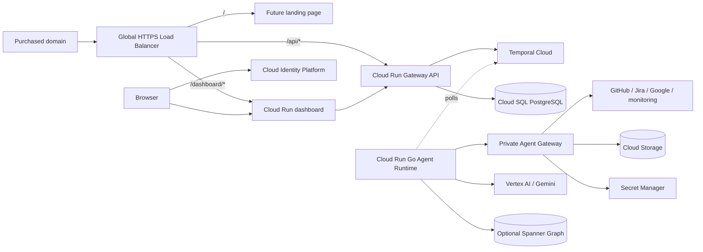

# Encois deployment blueprint

**Status:** initial GCP/Terraform scaffold

This document describes the smallest deployment that can host the Encois dashboard and Gateway API while leaving a clean path for the Go Temporal/ADK workers. It is a blueprint, not a live deployment: no GCP API call is made by creating these files, and no credentials are stored in the repository.

## Current deployment blockers

The Cloud Run scaffold now matches the current Go worker contract: the API
uses `TEMPORAL_ADDRESS`, the worker uses `TEMPORAL_HOST_PORT`, both receive the
Temporal API key from Secret Manager, and the worker exposes internal
`/health/live` and `/health/ready` endpoints. When both private services are
enabled, Terraform also wires the Agent Gateway URL and its separate service
token to the worker and grants each service only the secret it needs. When the
API and Runtime are enabled together, it also wires the private control-plane
URL, Cloud Run audience, shared application token, and Runtime service-account
invoker grant. Vertex AI mode is enabled with Application Default Credentials;
the Runtime does not need a Gemini API key in Cloud Run.

This is still an infrastructure blueprint, not a verified deployment. The
remaining blockers are built/pushed immutable container images, a real Temporal
Cloud namespace/API key, populated Secret Manager versions, a GCP project, and
a smoke test against the deployed services. The local multi-process synthetic
smoke path has already passed.

The broader release options are documented in [`docs/CI-CD.md`](CI-CD.md). This file stays focused on the infrastructure resources and their manual bootstrap.

## Target shape



The initial public edge is one domain with path routing:

| Path | Target | Exposure |
| --- | --- | --- |
| `/` | Dashboard until a landing-page service is added | Public edge; app auth still applies where needed |
| `/dashboard` and `/dashboard/*` | React dashboard Cloud Run service | Public edge, direct `run.app` ingress blocked |
| `/api/*` and `/healthz` | Hono Gateway API Cloud Run service | Public edge, auth/authorization in the API |
| no public route | Go runtime and Agent Gateway | Internal-only Cloud Run services |

Cloud Run does not perform multi-service path routing by itself. The global external HTTPS Application Load Balancer and regional serverless NEGs provide that routing. The Cloud Run services use `internal-and-cloud-load-balancing` ingress so users cannot bypass the edge through the default service URL.

The React image must be built with `--build-arg VITE_BASE_PATH=/dashboard/` for
the hosted path. Vite assets and TanStack Router now use the same base path;
local development keeps `/` by default. Pass the public Firebase web
configuration as `VITE_FIREBASE_*` build arguments when hosted Google login is
enabled. Terraform can route the request, but it cannot rewrite SPA asset URLs
or client-side routes after the image is built.

## Terraform layout

```text
infra/
  bootstrap/              one-time state bucket and infra deployer
  versions.tf             provider and Terraform version constraints
  apis.tf                 enabled Google APIs
  iam.tf                  runtime service accounts and permissions
  artifact_registry.tf    container repository
  cloud_run.tf            dashboard, API, runtime, Agent Gateway
  load_balancer.tf        HTTPS, certificate, path routing, HTTP redirect
  identity.tf             optional Identity Platform config
  cloud_sql.tf            optional Cloud SQL PostgreSQL control plane
  storage.tf              optional raw artifact bucket
  secrets.tf              secret containers, never secret values
  spanner.tf              optional normalized context database
  backend.tf.example      remote-state configuration template
```

The root stack is a GCP adapter. Application code should depend on interfaces such as `ObjectStore`, `SecretProvider`, `WorkflowClient`, and `GraphStore`; only `infra/` should know that the first implementation is Cloud Run, Cloud Storage, Secret Manager, Spanner, and Temporal Cloud. A future AWS/Azure deployment can keep the app contracts and replace the provider-specific Terraform modules and CI wiring. Terraform itself is not a multi-cloud abstraction layer, so portability comes from keeping the provider boundary narrow rather than hiding every cloud feature behind generic variables.

## Local development

Terraform is not a local application runner. It describes cloud infrastructure, creates or updates GCP resources after an explicit `plan/apply`, and points Cloud Run at already-built container images. It does not start the React dev server, Hono API, Go worker, or Temporal server on a laptop.

The currently supported local path is the existing pnpm workspace:

```bash
pnpm install
```

Run the dashboard:

```bash
pnpm dev
```

Run the API in a second terminal:

```bash
pnpm --filter @encois/api-gateway dev
```

Open `http://localhost:5173` for the dashboard and use `http://127.0.0.1:8787/health/live` or `/health/ready` for the API. The API defaults are documented in [`apps/api-gateway/.env.example`](../apps/api-gateway/.env.example). The Compose stack provides PostgreSQL and applies migrations before starting the API.

The canonical full local stack is:

- `pnpm dev:local` runs `compose.local.yaml` with Postgres, the official
  Temporal development image, migrations, Firebase Auth Emulator, the local
  auth seed, all four application services, and the dashboard. The local
  Runtime uses `AGENT_AI_MODE=mock`; no Gemini key or GCP credentials are
  required. See [`docs/local.md`](local.md) for the login and onboarding test.

For the existing Go runtime, both paths are supported: the Temporal CLI's
development server for local work, or Temporal Cloud credentials injected
through environment/Secret Manager for a hosted demo. The Runtime starts a
Temporal Worker explicitly, marks `/health/ready` only after the Worker starts,
and reports fatal worker errors through the process health state.

For hosted Runtime → Agent Gateway calls, Cloud Run IAM supplies the Google ID
token whose audience is the Agent Gateway service URL. The Runtime also sends a
separate `X-Encois-Service-Token`; the Gateway validates both layers. Local
development can use the legacy static bearer token without Cloud Run IAM. The
Agent Gateway readiness probe fails closed when the service token is missing,
so a misconfigured revision does not receive Runtime traffic.

For the hackathon, the practical progression is: run the complete local Compose
stack, build immutable images in CI, deploy the same application images to
Cloud Run, and show the hosted Cloud Run/API/agent run evidence in the demo.
Local Docker is useful for reproducibility but is not a substitute for the
required Google Cloud deployment proof.

## What is enabled by default

The safe defaults create only the API/service foundation and secret containers when explicitly applied. Services that require container images, billing, a purchased domain, or billable data stores are opt-in through `terraform.tfvars`:

- Cloud Run service creation is disabled until an immutable image is supplied.
- Identity Platform is disabled until the project has billing and the auth policy is confirmed.
- The external load balancer and managed certificate are disabled until DNS is ready.
- Spanner is disabled because it is billable and its Graph/data model is not yet finalized.
- Cloud SQL is disabled because it is billable; when enabled it is the control-plane database for Drizzle migrations and API runtime state.
- Cloud Storage is disabled unless a globally unique bucket name is provided.

The Artifact Registry repository is part of the base stack. Image builds and pushes belong in CI, not in Terraform. Use immutable image tags or digests for deploys; do not use `latest` in production.

## Identity and permissions

There are three distinct permission planes:

1. **Human/application identity:** Cloud Identity Platform authenticates users. The Gateway API verifies the ID token and computes organization scope deterministically. Identity Platform does not replace application authorization.
2. **Runtime identities:** dashboard, API, Agent Runtime, and Agent Gateway each have a separate Google service account. The runtime identities do not share provider credentials.
3. **Infrastructure identity:** `infra/bootstrap` creates a dedicated Terraform deployer service account. It is not used by any Cloud Run container.

The Agent Gateway gets access to connector secret containers; the Go runtime gets Vertex AI access and can receive only scoped data references. Secret values are added separately with `gcloud secrets versions add` or a secret-management pipeline. Terraform manages the secret resource and IAM binding, not the secret payload.

The bootstrap deployer role list is intentionally explicit, but it includes the powerful `roles/resourcemanager.projectIamAdmin` because the root stack creates service-account IAM bindings. Treat that identity as infrastructure-admin, use short-lived impersonation or Workload Identity Federation, and do not create a JSON key. Once the resource set stabilizes, replace broad predefined roles with a reviewed custom role or split IAM changes into a separately protected bootstrap stack.

## State and deployer workflow

Terraform state contains resource metadata and can contain sensitive values from providers. It must use a private, versioned GCS bucket with restricted IAM. The state bucket has `prevent_destroy = true` in the bootstrap stack.

One-time bootstrap, performed by an authorized operator:

```bash
cp infra/bootstrap/terraform.tfvars.example infra/bootstrap/terraform.tfvars
# Edit the project and globally unique state bucket name.
terraform -chdir=infra/bootstrap init
terraform -chdir=infra/bootstrap plan
terraform -chdir=infra/bootstrap apply
```

Then configure the main stack:

```bash
cp infra/terraform.tfvars.example infra/terraform.tfvars
cp infra/backend.tf.example infra/backend.tf
# Replace project, domain, bucket, image, and backend placeholders.

terraform -chdir=infra init -migrate-state
terraform -chdir=infra validate
terraform -chdir=infra plan -out=tfplan
terraform -chdir=infra apply tfplan
```

The commands are intentionally manual and reviewable. Nothing runs automatically from this repository. CI can later run the same plan/apply flow using Workload Identity Federation and an approval gate for production; it should not receive a long-lived service-account key.

## Autoscaling baseline

- Dashboard and API: minimum 1, maximum 2 by default; set minimum to 0 for a low-cost demo environment.
- Agent Runtime: minimum 1, maximum 2. A continuously polling Temporal worker should not scale to zero.
- Agent Gateway: minimum 1, maximum 2 while it is a separate service; it may be in-process for the first vertical slice.
- Runtime concurrency is 1 to avoid uncontrolled parallel agent work. API concurrency is higher and should be tuned from metrics.
- Worker and gateway containers bind the Cloud Run `PORT`; the runtime's HTTP listener is health-only and the lack of a public route does not turn a Cloud Run service into a free-form VM.
- Timeouts, retries, budgets, provider rate limits, and workflow concurrency remain application/runtime policy, not load-balancer policy.

Coordinator outbox delivery is a separate one-shot process in the API image:
`dist/coordinator-dispatcher.js`. It requires
`COORDINATOR_DISPATCH_ORGANIZATION_ID` and is intended to run as a Cloud Run
Job invoked by Cloud Scheduler, one tenant per invocation. The Terraform
scaffold does not create the Job or scheduler because their cadence, tenant
inventory, and deployment IAM are environment-specific; the job must use the
API/runtime service identity and only the required invocation permissions.

This is deliberately not Kubernetes. Cloud Run provides revisioned deployments, request-driven scaling, health checks, and rollback without operating a cluster. Temporal Cloud remains the durable workflow engine; Cloud Run is only the execution host for the API and workers.

## Deliberately deferred

- Cloud project creation, billing attachment, organization/folder policy, and DNS registrar changes.
- Temporal Cloud namespace/provider automation; credentials are external secret inputs.
- Cloud Armor, IAP, VPC Service Controls, private egress, and customer-specific data residency.
- Spanner Graph schema, Memory Bank configuration, database migrations, and retention/deletion workflows.
- Cloud SQL private-IP/HA topology, IAM database authentication, and the first migration execution in the target project.
- GitHub Actions/Cloud Build workflow files, vulnerability scanning, SBOM, image signing, and production approval policy.
- Landing-page Cloud Run service. Until it exists, `/` falls back to the dashboard backend.

These are not hidden assumptions; they are the next infrastructure decisions after the first vertical slice runs locally.

## References

- [Google Cloud: external Application Load Balancer with serverless NEGs](https://cloud.google.com/load-balancing/docs/https/setting-up-https-serverless)
- [Google Cloud: Cloud Run ingress restrictions](https://cloud.google.com/run/docs/securing/ingress)
- [Terraform Google provider: Identity Platform config](https://registry.terraform.io/providers/hashicorp/google/latest/docs/resources/identity_platform_config)
