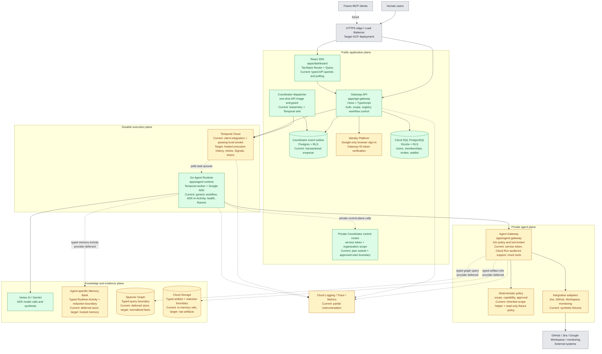
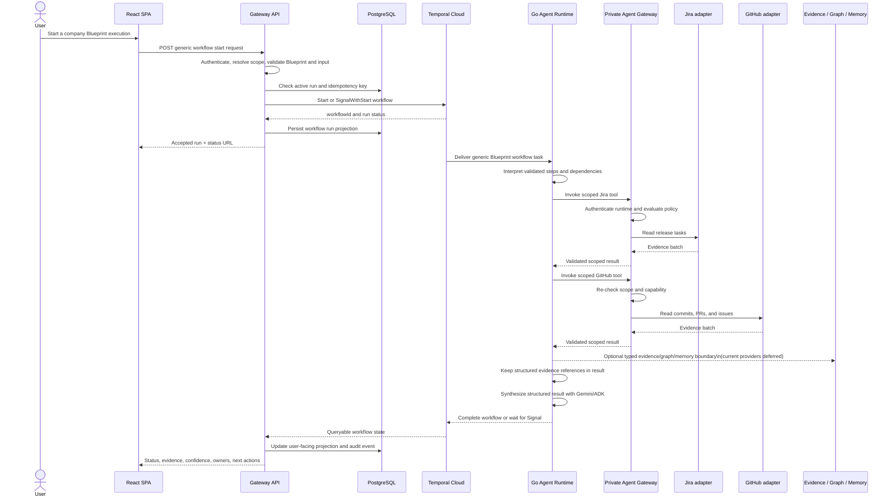

# Encois System Diagram

**Status:** living current-state map  
**Last reviewed:** 2026-08-21
**Purpose:** keep one diagram that shows the current system shape, deployable boundaries, and the parts that are still scaffold or deferred.

This document is the visual map of the repository. It should be updated when a service boundary, runtime responsibility, data store, or deployment path changes. Detailed behavioral scenarios belong in [`flows.md`](flows.md); component decisions belong in [`architecture.md`](architecture.md).

## Legend

- Green: implemented boundary or working local path.
- Yellow: implemented boundary with a mock, deferred adapter, or incomplete hosted enforcement.
- Blue: target capability with no current repository boundary.
- Gray: external system or managed platform.
- Dashed arrows: optional, future, or not yet connected in the current vertical slice.

## Current system overview

The diagram intentionally shows the architecture and the implementation status together. The current local proof path uses the real TypeScript Temporal client, a local Temporal server, the Go Worker, the Agent Gateway, and synthetic provider fixtures; the API-only development path can still use the in-memory adapter. The target path keeps the same boundaries but replaces local services and fixtures with hosted authenticated services and managed Google Cloud resources.

Human access is invite-only in the current slice: Google/Identity Platform
provides the external identity, the Gateway matches a verified email to a
pending invite and provisions local membership, and unknown identities can
only submit the waitlist form. Identity Platform accounts and Encois users are
separate records; the local `users` row is the authorization projection.

All data-plane arrows are expected to carry organization scope, provenance, and
freshness. Memory writes additionally pass the deterministic `regex-v1`
redaction boundary. Temporal Namespace is shown as an execution platform
setting, not as a substitute for Gateway authorization.

## Deployable service boundaries

```mermaid
flowchart LR
    subgraph DashboardService[Cloud Run: Dashboard]
        Dashboard[Static React SPA\nNo provider credentials\nCalls only Gateway API]
    end

    subgraph ApiService[Cloud Run: Gateway API]
        Routes[Hono routes]
        RuntimeControl[Private Coordinator routes\nService token + organization scope]
        Middleware[Request ID, auth, validation, rate limits]
        Control[Control-plane services\norganizations, permissions, registry, workflows]
        TemporalClient[Temporal TypeScript client]
        Persistence[Drizzle repositories]
    end

    subgraph TemporalService[Temporal Cloud]
        TaskQueue[Task queues]
        History[Workflow history\nTimers, retries, Signals]
    end

    subgraph RuntimeService[Cloud Run or worker host: Go Agent Runtime]
        Worker[Temporal Go worker]
        Workflows[Workflow definitions\nCoordinator + generic Blueprint\nRelease readiness is an example]
        Activities[Activities\nprovider calls, synthesis, persistence references]
        ADK[Google ADK agents\nplanner, specialists, synthesizer\nCurrent: Activity boundary\nCandidate: googleadk v0.2.0 spike]
        RuntimeClient[Private Agent Gateway client]
    end

    subgraph GatewayService[Internal Cloud Run: Agent Gateway]
        GatewayHTTP[Gin HTTP server]
        GatewayAuth[Service identity + execution context]
        GatewayPolicy[Deterministic policy engine]
        ToolRegistry[Tool registry and allowlists]
        ProviderAdapters[Integration adapters]
    end

    SQL[(PostgreSQL)]
    Google[Vertex AI / Gemini]
    Provider[External provider APIs / MCP]
    Evidence[(Cloud Storage\nCurrent: in-memory ArtifactStore)]
    CompanyGraph[(Spanner Graph\nCurrent: deferred GraphStore)]
        AgentMemory[(Memory Bank\nCurrent: deferred store + active redaction boundary)]

    Dashboard --> Routes
    RuntimeClient -. private control plane .-> RuntimeControl
    RuntimeControl --> Middleware
    Routes --> Middleware --> Control
    Control --> Persistence --> SQL
    Control --> TemporalClient --> TaskQueue
    TaskQueue --> Worker
    History --> TemporalClient
    Worker --> Workflows --> Activities
    Activities --> ADK
    Activities --> RuntimeClient --> GatewayHTTP
    GatewayHTTP --> GatewayAuth --> GatewayPolicy --> ToolRegistry --> ProviderAdapters
    ProviderAdapters --> Provider
    ADK --> Google
    Activities -. typed artifact refs\nprovider deferred .-> Evidence
    RuntimeClient -. typed graph query\nprovider deferred .-> CompanyGraph
    ADK -. typed memory Activity\nprovider deferred .-> AgentMemory

    classDef live fill:#dcfce7,stroke:#15803d,color:#14532d
    classDef scaffold fill:#fef3c7,stroke:#b45309,color:#78350f
    classDef target fill:#dbeafe,stroke:#2563eb,color:#1e3a8a
    classDef external fill:#e5e7eb,stroke:#6b7280,color:#1f2937

    class Dashboard,Routes,RuntimeControl,Middleware,Control,TemporalClient,Persistence,Worker,Workflows,Activities,ADK live
    class GatewayHTTP,GatewayAuth,GatewayPolicy,ToolRegistry,ProviderAdapters scaffold
    class Evidence,CompanyGraph,AgentMemory scaffold
    class SQL,Google,Provider external
```

The Go Runtime is a worker application, not a public API and not a collection of one server per agent. Workflows and Activities are registered in the worker process. A Jira specialist or GitHub specialist is a logical agent/integration capability inside that runtime and Agent Gateway boundary, not automatically a separate microservice.

## Release investigation execution flow

If a release is unknown, the workflow should persist a reviewable blocked state and ask for a user signal or an approved data update. It should not silently invent a release, broaden permissions, or repeatedly spawn new agents.

## Update rules

Update this document when one of the following changes:

- a deployable service or public/private boundary is added or removed;
- a workflow moves between the API, Temporal, Runtime, or Agent Gateway;
- a data store becomes the source of truth for a category of data;
- an integration changes from mock/scaffold to a real adapter;
- authentication, policy, or service-to-service trust changes;
- the local or Google Cloud deployment path changes.

When only a user journey changes, update [`flows.md`](flows.md). When a technology choice or ownership rule changes, update [`architecture.md`](architecture.md) and record the implementation status here.
